# Project 1 Report

## Setup
### Environment
- Intel Core i7-11850H running Windows Subsystem for Linux (Ubuntu 22.04, GCC 11.4.0)
- Process affinity pinned to a single logical core; DVFS locked to reduce timing noise
- Affinity enforced in `kernels.cpp` by calling `SetProcessAffinityMask(..., 0x1)` on Windows or `sched_setaffinity(0, mask={CPU0})` on Linux before benchmarks begin
- Windows power plan min/max processor state capped at 99% to clamp turbo boost and stabilize frequency

### Toolchain
- `kernels.cpp` compiled twice: scalar baseline (`-O1 -fno-tree-vectorize`) and SIMD build (`-O3 -march=native -ffast-math`)
- Python orchestration via `project_manager.py` and experiment scripts in `experiments/`

### Dependencies
- Python packages: `numpy`, `pandas`, `matplotlib`
- System utilities: `g++`, `lscpu`, POSIX affinity APIs (or Win32 equivalents)

### Configuration
- Outputs written to timestamped directories that record warm/cold cache state
- Randomized initial values sized to avoid denormals or trivial checksums
- Each data point averaged over at least three trials, with optional warm-up iterations
- Problem sizes sweep L1/L2/L3/DRAM working-set boundaries to expose locality effects
- Logs, CSVs, and plots archived for every run to support reproducibility

## Baseline Correctness
### Methodology
- Use `n_midpoints` to sample each kernel (SAXPY, Dot, ElemMul, Stencil) at the midpoints of the L1/L2/L3/DRAM working-set regions.
- For every midpoint execute scalar followed by SIMD runs (with the optional warm-up pass when requested) while recording runtimes and kernel checksums.
- Transform the collected timings into mean/variance statistics, GFLOP/s, and scalar-versus-SIMD speedup, flagging any validation failures.
- Write all artifacts (log, CSV, and per-kernel plus aggregate runtime/throughput/speedup plots) to `plots/baseline_<timestamp>_<cache_state>/` for later inspection.

### Plots
#### Throughput
<figure>
  <figcaption><strong>Figure 1.</strong> SIMD vs Scalar Throughput For Baseline Test with Cold Cache</figcaption>
  <table>
    <tr>
      <td></td>
      <td></td>
    </tr>
    <tr>
      <td></td>
      <td>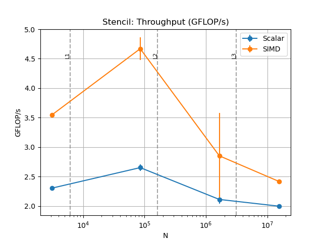</td>
    </tr>
  </table>
</figure>
<figure>
  <figcaption><strong>Figure 2.</strong> SIMD vs Scalar Throughput For Baseline Test with Warm Cache</figcaption>
  <table>
    <tr>
      <td></td>
      <td>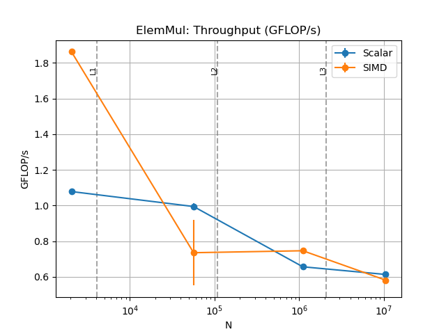</td>
    </tr>
    <tr>
      <td>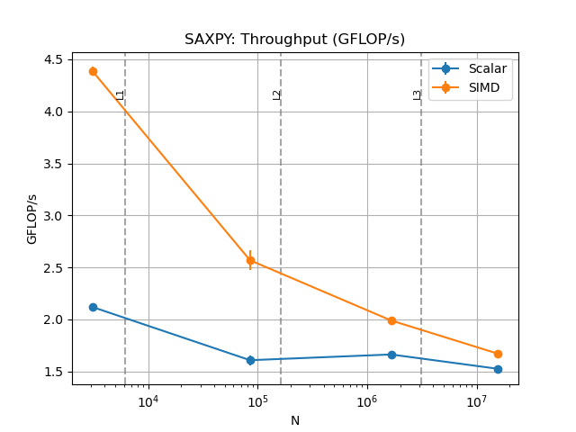</td>
      <td></td>
    </tr>
  </table>
</figure>

#### Runtime and Speedup
<figure>
  <figcaption><strong>Figure 3.</strong> SIMD vs Scalar Runtime For Baseline Test with Warm Cache</figcaption>
  <table>
    <tr>
      <td></td>
      <td></td>
    </tr>
    <tr>
      <td></td>
      <td>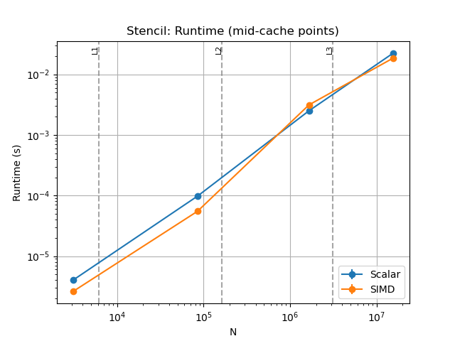</td>
    </tr>
  </table>
</figure>
<figure>
  <figcaption><strong>Figure 4.</strong> SIMD Speedup vs Scalar For Baseline Test with Warm Cache</figcaption>
  <table>
    <tr>
      <td>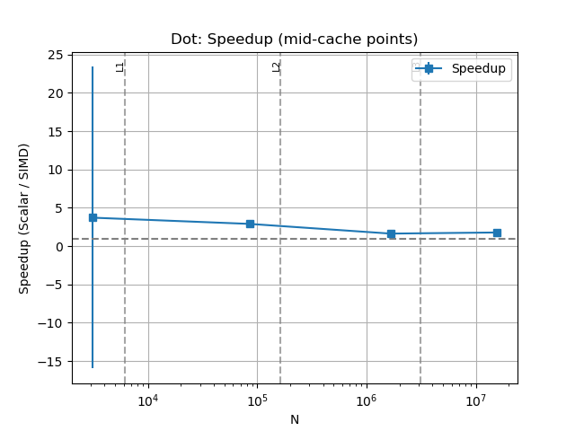</td>
      <td></td>
    </tr>
    <tr>
      <td></td>
      <td>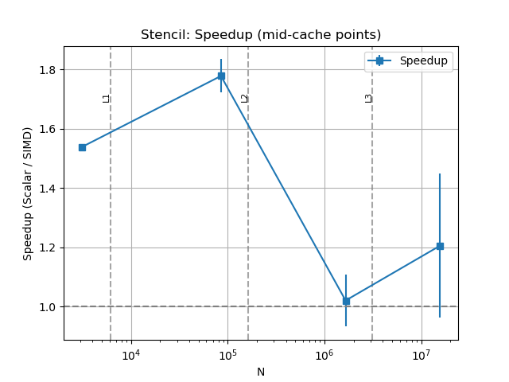</td>
    </tr>
  </table>
</figure>

### Analysis
- In the majority of cases, SIMD compilation allows for higher throughput and faster runtime.
- As larger memory regions were accessed, the performance improvement of SIMD over the scalar version diminished.
    - This reduction is likely due to the fact that accessing larger caches or DRAM takes more time than accessing small caches like L1. 
    - SIMD vs Scalar impacts the time used for computation, but it does not impact how much time is used for memory management.
    - Thus, as a higher proportion of total time is spend managing memory vs performing computation, the positive effect of using SIMD is reduced.
- In some cases with high `N`, the scalar version even performs better than SIMD
    - This is probably due to the effects of other processor variations, such as thermal environment or background tasks, being larger than the impact of SIMD for these cases.
- As shown in Figure 1, running tests on a cold cache tends to introduce more variability into the system, as indicated by larger error bars.
    - This makes sense, as warming up the cache with a 'dummy' run ensures consistency across all 3 trials.
    - Note: Data from 'cold' vs 'warm' runs was collected for all experiments and graphs can be viewed in the `\plots\` folder. Throughout the experiments, cold runs had slightly larger uncertainty than the warm runs. However, for the sake of brevity, the rest of this report will focus only on warm runs.  

## Vectorization Verification

To verify that SIMD vectorization occurred as intended, compiler output was inspected. Assembly listings were generated using `objdump -d` and confirmed the presence of SIMD opcodes. For my CPU, this includes instructions such as `vmovups`, `vfmadd231ps`, and `vmulps`. I performed this process on both the scalar and SIMD versions to confirm correct compilation.

<figure>
  <figcaption><strong>Figure 5.</strong> The SIMD-compiled version performs a variety of vector operations to execute the kernels.</figcaption>
  
</figure>

<figure>
  <figcaption><strong>Figure 6.</strong> The scalar-compiled version contains no operations on vectors.</figcaption>
  
</figure>

As seen in these figures, only the SIMD-compiled version performs SIMD operations on vectors, as indicated by the `ymm` variables.

This inspection provides direct confirmation that the compiler was emitting vector instructions rather than scalar equivalents, ensuring that measured performance differences between scalar and SIMD kernels reflected true vector execution.  

## Locality Sweep
### Methodology
- Construct a `logspace` sweep of `N` for each kernel that starts well below the L1 footprint and extends deep into DRAM-resident regions using `cache_thresholds` as anchors.
- Run scalar then SIMD binaries across the sweep with the shared warm-up handling, capturing runtimes and output checksums for every sample.
- Post-process the timings into GFLOP/s, scalar/SIMD speedup, and cycles-per-element using the detected CPU frequency to spotlight locality breakpoints.
- Store the detailed log, CSV, and runtime/throughput/speedup/CPE plots in `plots/locality_<timestamp>_<cache_state>/` for memory-hierarchy analysis.

### Plots
<figure>
  <figcaption><strong>Figure 7.</strong> SIMD vs Scalar Throughput For Locality Sweep with Warm Cache</figcaption>
  <table>
    <tr>
      <td></td>
      <td>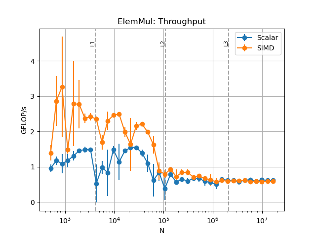</td>
    </tr>
    <tr>
      <td>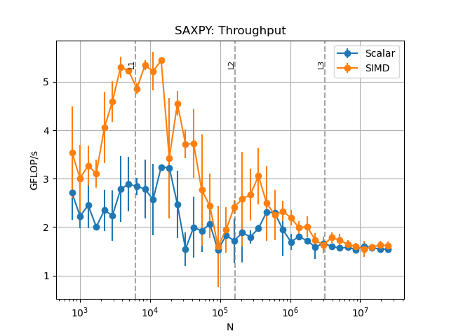</td>
      <td>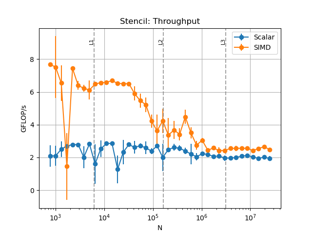</td>
    </tr>
  </table>
</figure>
<figure>
  <figcaption><strong>Figure 8.</strong> SIMD vs Scalar Runtime For Locality Sweep with Warm Cache</figcaption>
  <table>
    <tr>
      <td></td>
      <td></td>
    </tr>
    <tr>
      <td></td>
      <td>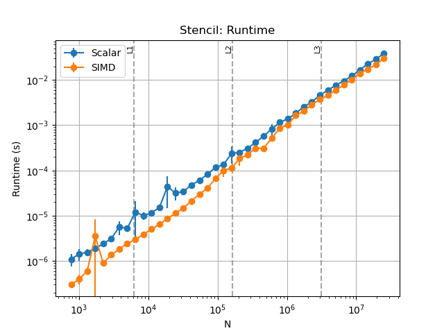</td>
    </tr>
  </table>
</figure>
<figure>
  <figcaption><strong>Figure 9.</strong> SIMD vs Scalar Speedup For Locality Sweep with Warm Cache</figcaption>
  <table>
    <tr>
      <td></td>
      <td></td>
    </tr>
    <tr>
      <td>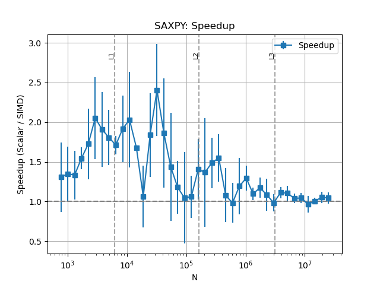</td>
      <td>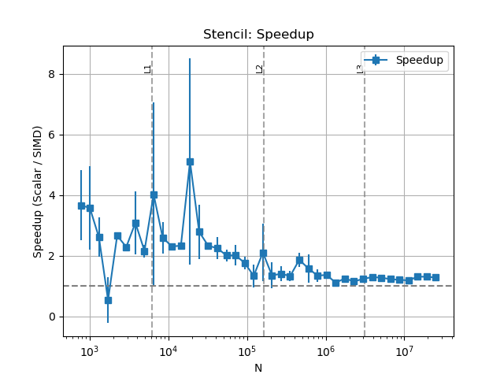</td>
    </tr>
  </table>
</figure>
<figure>
  <figcaption><strong>Figure 10.</strong> SIMD vs Scalar CPE For Locality Sweep with Warm Cache</figcaption>
  <table>
    <tr>
      <td></td>
      <td></td>
    </tr>
    <tr>
      <td></td>
      <td></td>
    </tr>
  </table>
</figure>

### Analysis
- As in the baseline trials, it is important to note that SIMD provides consistently provides a significant performance increase compared to the scalar version.\
- However, as previously noted, these gains diminish as N increases and more of the memory heirarchy must be accessed.
- The denser locality sweep reveals sharp drop-offs in relative SIMD improvement near the midpoint of each cache boundary.
  - This makes sense, because more time must be spent retrieving values from memory as more of each level is used, reducing the impact of the SIMD speedup.
- Additionally, investigating Cycles Per Element for each kernel tells a similar story.
  - In the L1 region, the SIMD version requires a much lower CPE to execute each kernel.
  - However, as more memory is needed, the CPE's for both versions begin to converge, primarily due to the SIMD version slowing down as it becomes memory-bound.
- Based on these graphs, it appears that the kernels become memory-bound near where N=10^5.
  - This is reasonable since this is near the L2->L3 cache boundary, which requires more intensive memory management.

## Alignment Tail
### Methodology
- For every kernel enumerate the `build_N_variants` tail sizes (`no_tail_16x`, `no_tail_8x`, `tail`) and test each with aligned (offset 0) and misaligned (offset 1) buffer starts to stress tail handling.
- Run scalar immediately followed by SIMD for each `(kernel, tail_kind, alignment)` combination, applying the shared warm-up policy and collecting timing plus checksum data.
- Reduce the runs to runtime, GFLOP/s, and speedup summaries so the cost of misalignment and remainder cleanup is explicit.
- Publish the log, CSV, and comparison plots under `plots/alignment_tail_<timestamp>_<cache_state>/` to review alignment-driven effects.
### Plots
<figure>
  <figcaption><strong>Figure 11.</strong> SIMD vs Scalar Throughput For Alignment and Tail with Warm Cache</figcaption>
  <table>
    <tr>
      <td>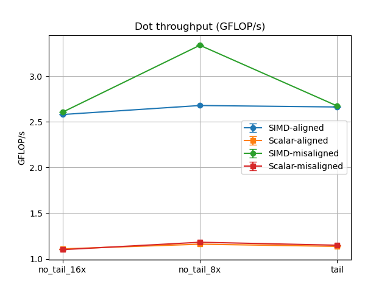</td>
      <td></td>
    </tr>
    <tr>
      <td></td>
      <td>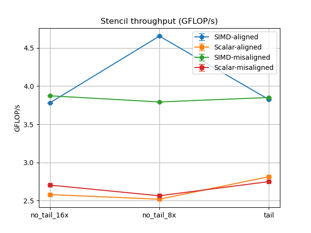</td>
    </tr>
  </table>
</figure>
<figure>
  <figcaption><strong>Figure 12.</strong> SIMD vs Scalar Runtime For Alignment and Tail with Warm Cache</figcaption>
  <table>
    <tr>
      <td></td>
      <td>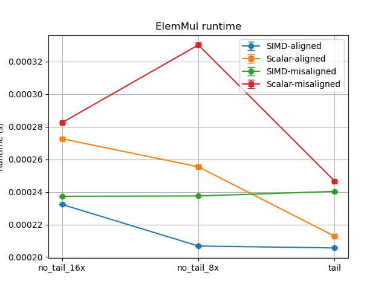</td>
    </tr>
    <tr>
      <td>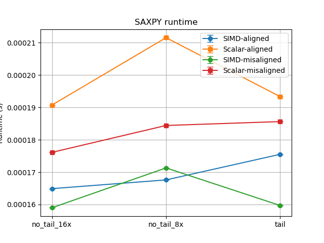</td>
      <td></td>
    </tr>
  </table>
</figure>
<figure>
  <figcaption><strong>Figure 13.</strong> SIMD vs Scalar Speedup For Alignment and Tail with Warm Cache</figcaption>
  <table>
    <tr>
      <td>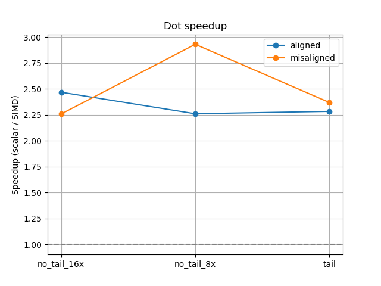</td>
      <td></td>
    </tr>
    <tr>
      <td>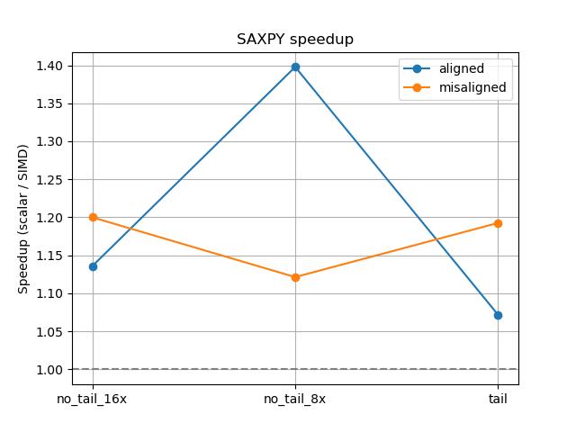</td>
      <td></td>
    </tr>
  </table>
</figure>

### Analysis
- Across all kernels, SIMD implementations generally outperform scalar ones, with Dot and Stencil showing the clearest throughput gains.
- The throughput gap is widest in the “no_tail_8x” cases (problem sizes perfectly divisible by the vector width). Here, SIMD executes full-width vector instructions without leftover work, yielding near-ideal efficiency.
- Scalar performance is relatively flat across alignment/tail conditions, since scalar code is unaffected by vector-width boundaries.
- Prologue/Epilogue Costs:
  - In tail cases, SIMD must execute additional cleanup work (scalar remainder loop or masked operations). This introduces a small but visible overhead, reducing throughput relative to the no-tail configurations.
  - The difference between no_tail_16x and no_tail_8x illustrates alignment-sensitive prologue behavior. no_tail_8x achieves higher throughput, suggesting more favorable alignment and fewer startup penalties.
- Unaligned Loads:
  - Misaligned SIMD runs (especially ElemMul and SAXPY) exhibit consistently lower throughput than aligned runs, confirming that unaligned vector loads carry a penalty.
  - The performance penalty is not catastrophic but measurable; throughput typically drops by 5–15% compared to aligned cases.
  - Stencil shows the clearest alignment sensitivity, with aligned SIMD significantly outperforming misaligned SIMD in the no-tail configurations.

## Stride Gather
### Methodology
- Fix the workload at `N = 32e6` and sweep each kernel across representative stride choices (1, 2, 8, 32) along with blocked and random gather patterns at configurable active fractions.
- Execute scalar then SIMD runs for every pattern using the shared warm-up cadence, logging runtimes, checksum validation, and the effective element count touched.
- Summarize runtime, GFLOP/s, and speedup per pattern to quantify penalties introduced by non-unit access.
- Consolidate the log, CSV, and stride/gather comparison plots inside `plots/stride_<timestamp>_<cache_state>/` for later review.

### Plots
<figure>
  <figcaption><strong>Figure 14.</strong> SIMD vs Scalar Throughput For Stride and Gather with Warm Cache</figcaption>
  <table>
    <tr>
      <td></td>
      <td></td>
    </tr>
    <tr>
      <td></td>
      <td></td>
    </tr>
  </table>
</figure>
<figure>
  <figcaption><strong>Figure 15.</strong> SIMD vs Scalar Runtime For Stride and Gather with Warm Cache</figcaption>
  <table>
    <tr>
      <td></td>
      <td></td>
    </tr>
    <tr>
      <td></td>
      <td></td>
    </tr>
  </table>
</figure>
<figure>
  <figcaption><strong>Figure 16.</strong> SIMD vs Scalar Speedup For Stride and Gather with Warm Cache</figcaption>
  <table>
    <tr>
      <td></td>
      <td></td>
    </tr>
    <tr>
      <td></td>
      <td></td>
    </tr>
  </table>
</figure>

### Analysis
- Overall, unit stride achieves the highest throughput across all kernels, with throughput decreasing as stride increases.
  - It makes sense that increasing stride (stride-2, stride-8, stride-32) rapidly degrades throughput because larger strides cause fewer useful elements per cache line, wasting bandwidth and reducing effective throughput.
- All kernels suffer a massive runtime increase with the random gather pattern.
  - Modern CPUs optimize memory management based on assumptions of spacial and temperal locality. A random access pattern negates these assumptions, causing memory management to dominate computation for performance
  - This pattern takes 2 orders of magnitude longer than the rest of the trials, and this penalty is virtually identical for both the vectorized and scalar versions. This makes sense, as any advantage of SIMD is being overshadowed by the effects of the random access pattern.
- Impact on Effective Bandwidth
  - Strided and gather accesses reduce effective bandwidth by forcing the memory system to move entire cache lines while only using a fraction of the data.
  - At large strides, only 1/8 or 1/32 of each cache line contributes useful work, dropping bandwidth efficiency proportionally.
- Prefetcher and Cache-Line Utilization Effects
  - Hardware prefetchers are highly effective for contiguous access but fail when strides exceed their detection window or when access patterns are irregular.
  - With predictable strides (stride-2), the prefetcher sometimes keeps up, but effectiveness collapses at larger strides (stride-32) or random access.
  - Poor cache-line utilization is the dominant cause of throughput collapse in random gather: most of the fetched cache line is unused, wasting bandwidth and stalling SIMD pipelines waiting for data.

## Datatype Comparison
### Methodology
- Apply `n_midpoints` to choose cache-representative sizes for each kernel under both `float32` and `float64`, enabling direct comparison of precision sensitivity.
- Run scalar then SIMD trials for every `(kernel, dtype, N)` pairing with the common warm-up approach, recording runtimes and checksum validations.
- Convert those measurements into runtime summaries, GFLOP/s, and speedup to contrast the precision-dependent behavior.
- Archive the log, CSV, and dtype-partitioned runtime/throughput/speedup plots in `plots/datatype_<timestamp>_<cache_state>/` for downstream analysis.

### Plots
<figure>
  <figcaption><strong>Figure 17.</strong> SIMD vs Scalar Throughput For Datatype Comparison with Warm Cache</figcaption>
  <table>
    <tr>
      <td></td>
      <td></td>
    </tr>
    <tr>
      <td>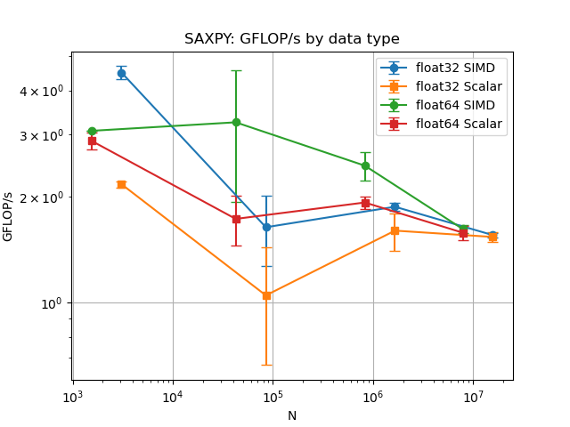</td>
      <td></td>
    </tr>
  </table>
</figure>
<figure>
  <figcaption><strong>Figure 18.</strong> SIMD vs Scalar Runtime For Datatype Comparison with Warm Cache</figcaption>
  <table>
    <tr>
      <td></td>
      <td></td>
    </tr>
    <tr>
      <td>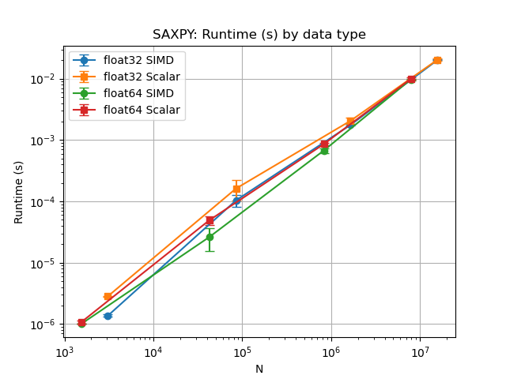</td>
      <td></td>
    </tr>
  </table>
</figure>
<figure>
  <figcaption><strong>Figure 19.</strong> SIMD vs Scalar Speedup For Datatype Comparison with Warm Cache</figcaption>
  <table>
    <tr>
      <td>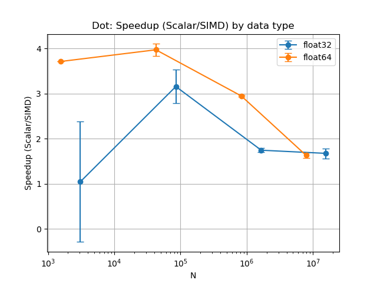</td>
      <td></td>
    </tr>
    <tr>
      <td></td>
      <td></td>
    </tr>
  </table>
</figure>

### Analysis
- For compute-heavy kernels (Dot, Stencil), float32 SIMD achieves noticeably higher performance increase than float64 SIMD. This reflects the doubled effective vector width for single precision (AVX2: 8 floats vs. 4 doubles per 256-bit register).
  - This demonstrates how kernels with a high arithmetic intensity are more susceptible to the effects of vector width.
- Scalar throughput and runtime shows less difference between float32 and float64, since scalar execution uses the same number of operations regardless of datatype width.
- Additionally, at small N, the cache locality results in significant SIMD speedup accross the board, potentially masking the differences caused by the datatypes.

## Roofline Analysis
### Methodology
- TODO: Summarize experimental procedure.
### Plots
- TODO: Link or describe throughput-focused visualizations.
### Analysis
- TODO: Capture SIMD vs scalar throughput behavior and alignment/tail effects.

## Limitations
- Single-core binding: All experiments were pinned to one physical core to ensure consistency. This removes noise but does not capture effects of multithreaded contention or shared resource pressure (e.g., last-level cache).

- Hardware vector width: The i7-11850H supports AVX2 (256-bit) but not AVX-512. Results therefore reflect at most 4 doubles or 8 floats per vector register. Wider SIMD units would alter both throughput and the magnitude of alignment/tail overheads.

- Lack of environmental control: Experiments attempted to maintain consistency by pinning to one physical core and restricting CPU performance to 99% of its maximum to disable turbo boost. However, since these expermients were performed on an active PC over the course of a few days, some factors like background tasks and thermal conditions could not be fully controlled for.

- Memory subsystem bottlenecks: Many kernels become memory-bound at large problem sizes, meaning SIMD compute units are underutilized. Results may be dominated by bandwidth and cache effects rather than arithmetic performance.

- Compiler dependence: Vectorization outcomes depend on GCC 11.4.0’s optimization heuristics. Other compilers or newer versions could generate different instruction mixes, especially for borderline cases like gathers or tail handling.

- WSL virtualization layer: Running under Windows Subsystem for Linux introduces an abstraction between hardware and the OS. While relatively lightweight, this can restrict direct control of CPU governors and may affect precise timing.

- Limited instruction set exploration: Experiments focused on standard AVX2 intrinsics and auto-vectorization. Specialized instructions (e.g., fused multiply-add variants, prefetch intrinsics) were not explored, which may limit achievable peak performance.
