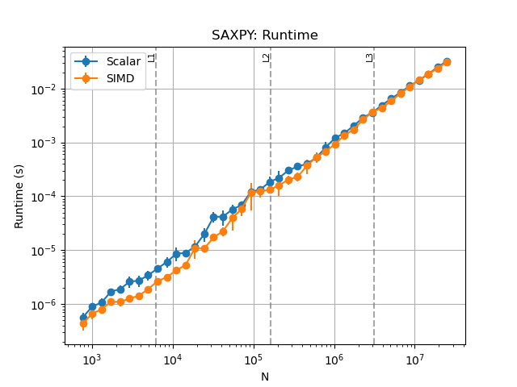
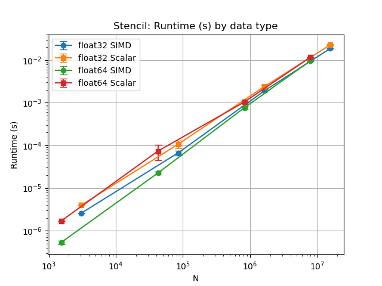

# Project 1: SIMD Performance and Microbenchmarking

## 1. Introduction
This project evaluates the performance of scalar versus SIMD execution on an Intel Core i7-11850H.  
A series of experiments were performed to measure throughput, runtime, and speedup across a range of kernels (SAXPY, Dot, ElemMul, Stencil).  
The experiments highlight how SIMD acceleration interacts with the memory hierarchy, alignment, access patterns, datatypes, and arithmetic intensity.  
Results are compared against theoretical expectations using roofline analysis.  

### System Setup
- **CPU:** Intel Core i7-11850H (Tiger Lake, 8C/16T)  
  - Base frequency: 2.50 GHz (Turbo disabled for consistency)  
  - AVX2 vector width: 256 bits (8×float32, 4×float64)  
  - L1: 32 KiB per core  
  - L2: 1.25 MiB per core  
  - L3: 24 MiB shared  
- **SMT state:** 
  - Enabled, but all experiments pinned to one physical core (`sched_setaffinity`).  
- **Frequency scaling:** 
  - Disabled (Windows power settings fixed at 99% min/max).  
- **OS/Environment:** 
  - Ubuntu 22.04 under WSL2 on Windows 10.  
- **Toolchain:**  
  - GCC 11.4.0  
  - Scalar builds: `-O1 -fno-tree-vectorize`  
  - SIMD builds: `-O3 -march=native -ffast-math`  
  - Python 3.10 + Numpy, Pandas, Matplotlib for orchestration and plotting.  

### General Methodology
- **Repetitions:**
  - Each experiment repeated ≥3 times; results reported as mean ± standard deviation.
  - One warm-up run performed prior to each set to stabilize cache state and CPU frequency.
  - Randomized trial order to reduce systematic bias (thermal drift, frequency scaling).
- **Data Collection and Reporting:**
  - Universal logging captured, labeled, and stored in `logs/`.
    - Logs config at runtime: CPU metadata, SMT state, cache sizes, DRAM specs, MLC/`perf` versions.
    - Records all commands run and terminal output.
  - Raw data and any summary tables labeled and stored in timestamped folder in `results/`.
    - All output data for all repetitions recorded to raw csv.
    - Averages and standard deviations across all repetitions recorded in summary table.
  - Relevent plots created in python using csv data and stored in timestamped folder in `plots/`
    - Error bars included on all plots.
    - Plots generated automatically after running experiments, but they could be created seperately using the csv data.
- **Script Management**
  - Individual experiment scripts found in `experiments/`.
  - Experiments run under a unified manager script for standardization.
  - Kernels written in a single `kernels.cpp` file, with scalar and SIMD binaries being compiled separately
- **Validation:** 
  - Checksums compared between scalar and SIMD runs to confirm correctness.

---

## 2. Baseline Correctness
### Purpose
Establish a scalar baseline and confirm correctness of SIMD implementations. Quantify throughput and runtime across cache-sized workloads.  

### Methodology
- **Kernels:**  
  - SAXPY, Dot, ElemMul, Stencil.  
- **Sample points:**  
  - Midpoints of L1, L2, L3, and DRAM working-set regions.  
- **Execution:**  
  - Scalar build (`-O1 -fno-tree-vectorize`) and SIMD build (`-O3 -march=native -ffast-math`).  
  - Runs executed back-to-back with optional warm-up run.  
- **Validation:**  
  - Checksums compared between scalar and SIMD runs to ensure correctness. 

### Plots
#### Throughput
<figure>
  <figcaption><strong>Figure 1.</strong> SIMD vs Scalar Throughput For Baseline Test with Cold Cache</figcaption>
  <table>
    <tr>
      <td></td>
      <td></td>
    </tr>
    <tr>
      <td></td>
      <td></td>
    </tr>
  </table>
</figure>
<figure>
  <figcaption><strong>Figure 2.</strong> SIMD vs Scalar Throughput For Baseline Test with Warm Cache</figcaption>
  <table>
    <tr>
      <td></td>
      <td></td>
    </tr>
    <tr>
      <td></td>
      <td></td>
    </tr>
  </table>
</figure>

#### Runtime and Speedup
<figure>
  <figcaption><strong>Figure 3.</strong> SIMD vs Scalar Runtime For Baseline Test with Warm Cache</figcaption>
  <table>
    <tr>
      <td></td>
      <td></td>
    </tr>
    <tr>
      <td></td>
      <td></td>
    </tr>
  </table>
</figure>
<figure>
  <figcaption><strong>Figure 4.</strong> SIMD Speedup vs Scalar For Baseline Test with Warm Cache</figcaption>
  <table>
    <tr>
      <td></td>
      <td></td>
    </tr>
    <tr>
      <td></td>
      <td></td>
    </tr>
  </table>
</figure>

### Analysis
- In the majority of cases, SIMD compilation allows for higher throughput and faster runtime.
- As larger memory regions were accessed, the performance improvement of SIMD over the scalar version diminished.
    - This reduction is likely due to the fact that accessing larger caches or DRAM takes more time than accessing small caches like L1. 
    - SIMD vs Scalar impacts the time used for computation, but it does not impact how much time is used for memory management.
    - Thus, as a higher proportion of total time is spend managing memory vs performing computation, the positive effect of using SIMD is reduced.
- In some cases with high `N`, the scalar version even performs better than SIMD
    - This is probably due to the effects of other processor variations, such as thermal environment or background tasks, being larger than the impact of SIMD for these cases.
- As shown in Figure 1, running tests on a cold cache tends to introduce more variability into the system, as indicated by larger error bars.
    - This makes sense, as warming up the cache with a 'dummy' run ensures consistency across all 3 trials.
    - Note: Data from 'cold' vs 'warm' runs was collected for all experiments and graphs can be viewed in the `\plots\` folder. Throughout the experiments, cold runs had slightly larger uncertainty than the warm runs. However, for the sake of brevity, the rest of this report will focus only on warm runs.  

## 3. Vectorization Verification

To verify that SIMD vectorization occurred as intended, compiler output was inspected. Assembly listings were generated using `objdump -d` and confirmed the presence of SIMD opcodes. For my CPU, this includes instructions such as `vmovups`, `vfmadd231ps`, and `vmulps`. I performed this process on both the scalar and SIMD versions to confirm correct compilation.

<figure>
  <figcaption><strong>Figure 5.</strong> The SIMD-compiled version performs a variety of vector operations to execute the kernels.</figcaption>
  
</figure>

<figure>
  <figcaption><strong>Figure 6.</strong> The scalar-compiled version contains no operations on vectors.</figcaption>
  
</figure>

As seen in these figures, only the SIMD-compiled version performs SIMD operations on vectors, as indicated by the `ymm` variables.

This inspection provides direct confirmation that the compiler was emitting vector instructions rather than scalar equivalents, ensuring that measured performance differences between scalar and SIMD kernels reflected true vector execution.  

## 4. Locality Sweep
- **Workload sweep:**  
  - `N` varied log-spaced from below L1 footprint to DRAM-resident sizes.  
- **Execution:**  
  - Both scalar and SIMD binaries with all kernels run for each `N`.  
  - Warm-up applied before each set to stabilize cache state.  
- **Validation:**  
  - Checksums verified across all runs.  
- **Metrics:**  
  - Runtimes converted into GFLOP/s, speedup, and cycles-per-element (CPE) using measured CPU frequency.  

### Plots
<figure>
  <figcaption><strong>Figure 7.</strong> SIMD vs Scalar Throughput For Locality Sweep with Warm Cache</figcaption>
  <table>
    <tr>
      <td></td>
      <td></td>
    </tr>
    <tr>
      <td></td>
      <td></td>
    </tr>
  </table>
</figure>
<figure>
  <figcaption><strong>Figure 8.</strong> SIMD vs Scalar Runtime For Locality Sweep with Warm Cache</figcaption>
  <table>
    <tr>
      <td></td>
      <td></td>
    </tr>
    <tr>
      <td></td>
      <td></td>
    </tr>
  </table>
</figure>
<figure>
  <figcaption><strong>Figure 9.</strong> SIMD vs Scalar Speedup For Locality Sweep with Warm Cache</figcaption>
  <table>
    <tr>
      <td></td>
      <td></td>
    </tr>
    <tr>
      <td></td>
      <td></td>
    </tr>
  </table>
</figure>
<figure>
  <figcaption><strong>Figure 10.</strong> SIMD vs Scalar CPE For Locality Sweep with Warm Cache</figcaption>
  <table>
    <tr>
      <td></td>
      <td></td>
    </tr>
    <tr>
      <td></td>
      <td></td>
    </tr>
  </table>
</figure>

### Analysis
- As in the baseline trials, it is important to note that SIMD provides consistently provides a significant performance increase compared to the scalar version.\
- However, as previously noted, these gains diminish as N increases and more of the memory heirarchy must be accessed.
- The denser locality sweep reveals sharp drop-offs in relative SIMD improvement near the midpoint of each cache boundary.
  - This makes sense, because more time must be spent retrieving values from memory as more of each level is used, reducing the impact of the SIMD speedup.
- Additionally, investigating Cycles Per Element for each kernel tells a similar story.
  - In the L1 region, the SIMD version requires a much lower CPE to execute each kernel.
  - However, as more memory is needed, the CPE's for both versions begin to converge, primarily due to the SIMD version slowing down as it becomes memory-bound.
- Based on these graphs, it appears that the kernels become memory-bound near where N=10^5.
  - This is reasonable since this is near the L2->L3 cache boundary, which requires more intensive memory management.

## 5. Alignment Tail
### Methodology
- **Tail handling modes:**  
  - `no_tail_16x`, `no_tail_8x`, `tail`.  
- **Alignment:**  
  - Buffers tested with aligned (offset 0) and misaligned (offset 1) starts.  
- **Execution:**  
  - Scalar and SIMD binaries run for every `(kernel, tail_kind, alignment)` combination.
- **Validation:**  
  - Checksums compared for correctness.  
- **Metrics:**  
  - Runtimes summarized into GFLOP/s and speedup.  

### Plots
<figure>
  <figcaption><strong>Figure 11.</strong> SIMD vs Scalar Throughput For Alignment and Tail with Warm Cache</figcaption>
  <table>
    <tr>
      <td></td>
      <td></td>
    </tr>
    <tr>
      <td></td>
      <td></td>
    </tr>
  </table>
</figure>
<figure>
  <figcaption><strong>Figure 12.</strong> SIMD vs Scalar Runtime For Alignment and Tail with Warm Cache</figcaption>
  <table>
    <tr>
      <td></td>
      <td></td>
    </tr>
    <tr>
      <td></td>
      <td></td>
    </tr>
  </table>
</figure>
<figure>
  <figcaption><strong>Figure 13.</strong> SIMD vs Scalar Speedup For Alignment and Tail with Warm Cache</figcaption>
  <table>
    <tr>
      <td></td>
      <td></td>
    </tr>
    <tr>
      <td></td>
      <td></td>
    </tr>
  </table>
</figure>

### Analysis
- Across all kernels, SIMD implementations generally outperform scalar ones, with Dot and Stencil showing the clearest throughput gains.
- The throughput gap is widest in the “no_tail_8x” cases (problem sizes perfectly divisible by the vector width). Here, SIMD executes full-width vector instructions without leftover work, yielding near-ideal efficiency.
- Scalar performance is relatively flat across alignment/tail conditions, since scalar code is unaffected by vector-width boundaries.
- Prologue/Epilogue Costs:
  - In tail cases, SIMD must execute additional cleanup work (scalar remainder loop or masked operations). This introduces a small but visible overhead, reducing throughput relative to the no-tail configurations.
  - The difference between no_tail_16x and no_tail_8x illustrates alignment-sensitive prologue behavior. no_tail_8x achieves higher throughput, suggesting more favorable alignment and fewer startup penalties.
- Unaligned Loads:
  - Misaligned SIMD runs (especially ElemMul and SAXPY) exhibit consistently lower throughput than aligned runs, confirming that unaligned vector loads carry a penalty.
  - The performance penalty is not catastrophic but measurable; throughput typically drops by 5–15% compared to aligned cases.
  - Stencil shows the clearest alignment sensitivity, with aligned SIMD significantly outperforming misaligned SIMD in the no-tail configurations.

## 6. Stride Gather
### Methodology
- **Workload size:**  
  - Fixed at `N = 32e6`.  
- **Stride patterns:**  
  - Unit stride (1), stride-2, stride-8, stride-32.  
  - Blocked and random gather patterns included.  
- **Execution:**  
  - Scalar then SIMD runs performed for each stride/gather pattern.  
- **Validation:**  
  - Checksums used to confirm correctness.  
- **Metrics:**  
  - Runtime, GFLOP/s, and speedup per pattern. 

### Plots
<figure>
  <figcaption><strong>Figure 14.</strong> SIMD vs Scalar Throughput For Stride and Gather with Warm Cache</figcaption>
  <table>
    <tr>
      <td></td>
      <td></td>
    </tr>
    <tr>
      <td></td>
      <td></td>
    </tr>
  </table>
</figure>
<figure>
  <figcaption><strong>Figure 15.</strong> SIMD vs Scalar Runtime For Stride and Gather with Warm Cache</figcaption>
  <table>
    <tr>
      <td></td>
      <td></td>
    </tr>
    <tr>
      <td></td>
      <td></td>
    </tr>
  </table>
</figure>
<figure>
  <figcaption><strong>Figure 16.</strong> SIMD vs Scalar Speedup For Stride and Gather with Warm Cache</figcaption>
  <table>
    <tr>
      <td></td>
      <td></td>
    </tr>
    <tr>
      <td></td>
      <td></td>
    </tr>
  </table>
</figure>

### Analysis
- Overall, unit stride achieves the highest throughput across all kernels, with throughput decreasing as stride increases.
  - It makes sense that increasing stride (stride-2, stride-8, stride-32) rapidly degrades throughput because larger strides cause fewer useful elements per cache line, wasting bandwidth and reducing effective throughput.
- All kernels suffer a massive runtime increase with the random gather pattern.
  - Modern CPUs optimize memory management based on assumptions of spacial and temperal locality. A random access pattern negates these assumptions, causing memory management to dominate computation for performance
  - This pattern takes 2 orders of magnitude longer than the rest of the trials, and this penalty is virtually identical for both the vectorized and scalar versions. This makes sense, as any advantage of SIMD is being overshadowed by the effects of the random access pattern.
- Impact on Effective Bandwidth
  - Strided and gather accesses reduce effective bandwidth by forcing the memory system to move entire cache lines while only using a fraction of the data.
  - At large strides, only 1/8 or 1/32 of each cache line contributes useful work, dropping bandwidth efficiency proportionally.
- Prefetcher and Cache-Line Utilization Effects
  - Hardware prefetchers are highly effective for contiguous access but fail when strides exceed their detection window or when access patterns are irregular.
  - With predictable strides (stride-2), the prefetcher sometimes keeps up, but effectiveness collapses at larger strides (stride-32) or random access.
  - Poor cache-line utilization is the dominant cause of throughput collapse in random gather: most of the fetched cache line is unused, wasting bandwidth and stalling SIMD pipelines waiting for data.

## 7. Datatype Comparison
### Methodology
- **Datatypes:**  
  - Single precision (float32) and double precision (float64).  
- **Sample points:**  
  - Midpoints of each cache region (`n_midpoints`).  
- **Execution:**  
  - Scalar then SIMD runs for each `(kernel, dtype, N)` pair.  
  - Warm-up used for consistency.  
- **Validation:**  
  - Checksums validated across all runs.  
- **Metrics:**  
  - Runtime, GFLOP/s, and speedup recorded. 

### Plots
<figure>
  <figcaption><strong>Figure 17.</strong> SIMD vs Scalar Throughput For Datatype Comparison with Warm Cache</figcaption>
  <table>
    <tr>
      <td></td>
      <td></td>
    </tr>
    <tr>
      <td></td>
      <td></td>
    </tr>
  </table>
</figure>
<figure>
  <figcaption><strong>Figure 18.</strong> SIMD vs Scalar Runtime For Datatype Comparison with Warm Cache</figcaption>
  <table>
    <tr>
      <td></td>
      <td></td>
    </tr>
    <tr>
      <td></td>
      <td></td>
    </tr>
  </table>
</figure>
<figure>
  <figcaption><strong>Figure 19.</strong> SIMD vs Scalar Speedup For Datatype Comparison with Warm Cache</figcaption>
  <table>
    <tr>
      <td></td>
      <td></td>
    </tr>
    <tr>
      <td></td>
      <td></td>
    </tr>
  </table>
</figure>

### Analysis
- For compute-heavy kernels (Dot, Stencil), float32 SIMD achieves noticeably higher performance increase than float64 SIMD. This reflects the doubled effective vector width for single precision (AVX2: 8 floats vs. 4 doubles per 256-bit register).
  - This demonstrates how kernels with a high arithmetic intensity are more susceptible to the effects of vector width.
- Scalar throughput and runtime shows less difference between float32 and float64, since scalar execution uses the same number of operations regardless of datatype width.
- Additionally, at small N, the cache locality results in significant SIMD speedup accross the board, potentially masking the differences caused by the datatypes.

## 8. Roofline Analysis
### Methodology
### Methodology
- **Kernels:**  
  - SAXPY, Dot, Stencil.  
- **Workload size:**  
  - Large DRAM-resident arrays (`N ≈ 32e6`).  
- **Execution:**  
  - Scalar and SIMD binaries compiled and executed with warm-up handling.  
- **Metrics:**  
  - Runtimes converted to GFLOP/s.  
  - Arithmetic intensity (FLOPs per byte moved) computed analytically:  
    - SAXPY: ~0.17 FLOPs/B  
    - Dot: 0.25 FLOPs/B  
    - Stencil: ~0.38 FLOPs/B  
- **Roofline construction:**  
  - Peak bandwidth ~40 GB/s (measured in Project 2).  
  - Peak compute = 80 GFLOP/s (2.5 GHz × 32 FLOPs/cycle per core).  
- **Output:**  
  - Results plotted on a roofline diagram to contextualize memory-bound vs compute-bound regimes.  

### Plots
<figure>
  <figcaption><strong>Figure 20.</strong> Roofline Model with Kernel Placements (SIMD and Scalar).</figcaption>
  
</figure>

### Analysis
- All tested kernels (SAXPY, Dot, Stencil) have arithmetic intensities well below the ridge point (AI* ≈ 2 FLOPs/B). This places them in the memory-bound regime, where attainable throughput is limited by memory bandwidth rather than raw compute capability.
- For SAXPY** and Stencil, the scalar versions already saturate the available bandwidth because each operation requires both heavy read and write traffic. SIMD reduces the number of instructions but does not alleviate the bandwidth bottleneck, so measured performance for scalar and SIMD nearly overlaps.
- In contrast, Dot shows a clearer SIMD benefit even in the same region:
  - Dot only reads two input arrays and accumulates into a single scalar, avoiding a large output write stream.
  - This lighter memory footprint and the compiler’s ability to efficiently vectorize the inner multiply–accumulate loop allow SIMD to achieve higher throughput than the scalar baseline.
- Overall, the roofline model correctly predicts that these kernels remain memory-bound, but it also highlights how differences in memory traffic patterns explain why Dot retains a SIMD benefit while SAXPY and Stencil do not.

## 9. Discussion of Anomalies/Limitations
- **Single-core binding:**  
  - All experiments were pinned to a single physical core to reduce variability.  
  - While this improves consistency, it does not capture effects of multithreading such as shared last-level cache contention, SMT interactions, or bandwidth saturation across cores.  

- **Vector width constraints (AVX2 only):**  
  - The i7-11850H supports AVX2 (256-bit) but not AVX-512.  
  - As a result, maximum vector width is limited to 8×float32 or 4×float64.  
  - Wider SIMD units would change both raw throughput and the relative cost of alignment/tail overheads.  

- **Environmental noise:**  
  - Turbo boost was disabled to stabilize frequency, but background OS tasks and thermal conditions still introduced variability.  
  - This explains occasional cases where scalar matched or exceeded SIMD performance at very large `N`.  

- **Memory subsystem bottlenecks:**  
  - Many kernels became memory-bound at larger sizes, leaving SIMD compute units underutilized.  
  - Once DRAM bandwidth is saturated, additional vectorization has no effect, masking SIMD benefits in SAXPY and Stencil.  

- **Virtualization layer (WSL2):**  
  - Experiments were run under Windows Subsystem for Linux, which adds a thin abstraction between hardware and OS.  
  - While lightweight, WSL2 restricts fine-grain control of CPU governors and may flatten subtle low-level effects (e.g., prefetcher tuning, DRAM scheduling).  

**Summary:**  
The primary limitations of this project arise from environment control (single-core pinning, WSL2 noise), hardware constraints (AVX2 only), and compiler heuristics. These factors did not invalidate results but did narrow the observed contrast between scalar and SIMD in some experiments. Most notably, memory-bound behavior dominated at large sizes, preventing SIMD from achieving theoretical peak gains.

## 10. Conclusion
This project systematically evaluated the performance impact of SIMD vectorization on an Intel Core i7-11850H.  
Across seven experiments, we measured runtime, throughput, and speedup while validating results against theoretical expectations of the memory hierarchy.  

- **Baseline correctness** confirmed the validity of both scalar and SIMD kernels, with SIMD showing consistent gains in cache-resident regions but diminishing benefit as memory effects dominated.  
- **Vectorization verification** established that measured improvements corresponded to true AVX2 execution, not compiler artifacts.  
- **Locality sweeps** highlighted cache hierarchy boundaries, showing strong SIMD speedups in L1/L2 that converged with scalar performance at DRAM scales. Cycles-per-element analysis confirmed this convergence once memory became the bottleneck.  
- **Alignment and tail handling** demonstrated that SIMD efficiency is highest when data aligns perfectly with vector width. Tail cleanup and misalignment penalties reduced throughput modestly but predictably.  
- **Stride and gather experiments** revealed how non-unit stride and irregular memory patterns cripple SIMD efficiency by wasting bandwidth and defeating hardware prefetchers. Random gather collapsed performance by two orders of magnitude, with both scalar and SIMD equally affected.  
- **Datatype comparison** showed that float32 achieves higher SIMD throughput than float64, directly reflecting vector width differences (8 vs. 4 elements per AVX2 register). Compute-heavy kernels like Dot and Stencil made this effect most visible.  
- **Roofline analysis** placed all kernels in the memory-bound regime (AI < 0.5 FLOPs/B). SAXPY and Stencil saturated DRAM bandwidth, explaining why SIMD provided little advantage. Dot retained SIMD benefit because its lighter memory footprint allowed vectorization to matter more.  

**Summary:**  
The experiments validated theoretical models of SIMD performance and memory hierarchy interaction. SIMD acceleration provides the largest benefit in compute-heavy and cache-resident workloads, but loses impact once kernels become memory-bound. Practical effects such as alignment, stride, and datatype width further modulate efficiency. The key lesson is that SIMD cannot overcome memory bottlenecks: performance at scale is dominated by locality, bandwidth, and cache/TLB behavior, not raw compute capability.
