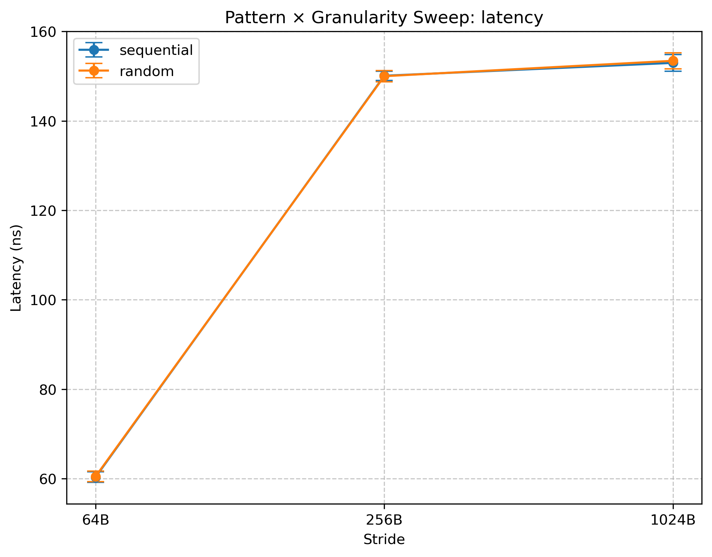
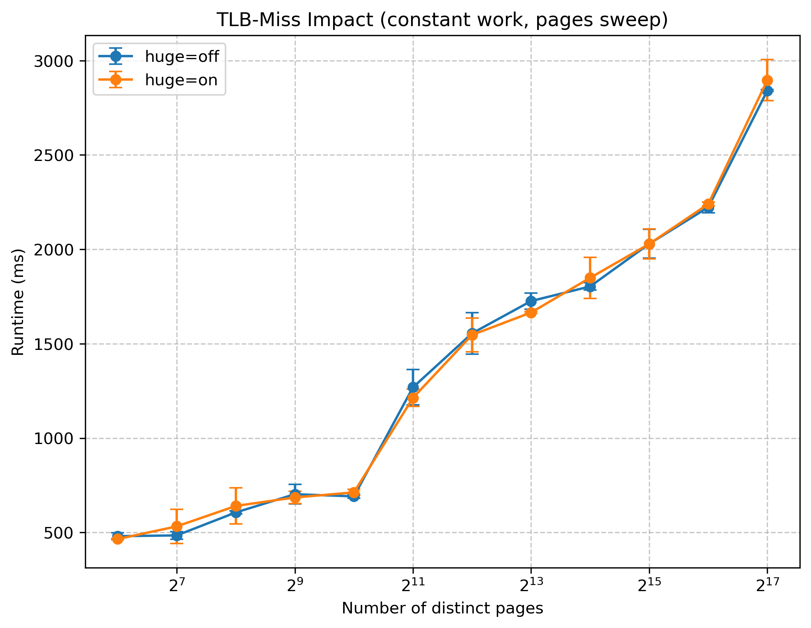

# Project 2: Cache & Memory Performance Profiling

## 1. Introduction
Modern CPUs have a deep memory hierarchy (L1, L2, L3, DRAM). This project characterizes latency, bandwidth, and TLB behavior using Intel MLC and Linux `perf`.  
We performed all required sweeps and correlated results with theory (AMAT, Little’s Law).  

**System Setup**
- **CPU:** Intel Core i7-11850H (Tiger Lake, 8C/16T)  
  - Base frequency: 2.50 GHz (Turbo disabled for consistency)  
  - L1 cache: 32 KiB per core (data), 48 KiB per core (instruction)  
  - L2 cache: 1.25 MiB per core (10 MiB total)  
  - L3 cache: 24 MiB shared  
  - DRAM: Dual-channel DDR4-3200 (25.6 GB/s theoretical peak)  
- **SMT state:** Enabled (Hyper-Threading on), but all experiments pinned to a single physical core  
- **Frequency scaling:** Disabled — Windows power settings fixed min/max CPU to 99% to prevent turbo; effectively locks at base frequency  
- **OS/Environment:** Ubuntu 22.04 running under WSL2 on Windows 10  
- **Tools:**  
  - Intel Memory Latency Checker (MLC) v3.11b  
  - Linux `perf` (for cache/TLB events)  
  - Python 3.10 + Matplotlib (for orchestration & plotting)

**Methodology**
- Each experiment repeated ≥3 times; results reported as mean ± standard deviation  
- One warm-up run performed prior to each set to stabilize cache state and CPU frequency  
- CPU pinning via `taskset -c 0` to isolate a single physical core  
- Randomized trial order to reduce systematic bias (thermal drift, frequency scaling)  
- Error bars included on all plots  
- Universal logging captured: CPU metadata, SMT state, cache sizes, DRAM specs, governor settings, MLC/`perf` versions, and any warnings (suppressed with justification)  
- Experiments structured under a unified manager script to ensure reproducibility (compilation, execution, logging, and plotting all automated)  

---

## 2. Zero-Queue Baselines (30 pts)
**Goal:**  
The purpose of this experiment is to measure the *isolated* memory access latency at each level of the hierarchy (L1, L2, L3, and DRAM). By forcing a single outstanding request at a time (“zero-queue” condition), we obtain the intrinsic access time without interference from concurrency, queuing, or bandwidth effects. These baseline latencies serve as reference points for all later experiments (working-set transitions, AMAT analysis, cache/TLB miss penalties).  

### Methodology
- Tool: Intel MLC v3.11b with the `--idle_latency` flag, which ensures a single in-flight request at a time.  
- Measurement: Latency captured in processor cycles, then converted to nanoseconds using the fixed base frequency (2.50 GHz).  
- Access types: Both load (read) and store (write, where supported) were tested, but the focus is on read latencies since writes may buffer.  
- Repetitions: Each measurement repeated 3 times; mean and standard deviation recorded.  
- Core isolation: Pinned to physical core 0 using `taskset -c 0`.  
- Warm-up: An initial run discarded to stabilize cache hierarchy and frequency.  
- Logging: Output parsed into a structured CSV file for later plotting.  
- Additional detail: We confirmed that hyper-threading and background activity were isolated (single-thread execution on one core).  

### Results
**Table 2.1: Measured Zero-Queue Latencies**  
| Level | Mean (ns) | Stddev (ns) | Mean (cycles) |
|-------|-----------|-------------|----------------|
| L1 | 2.13 | 0.06 | 5.33 |
| L2 | 7.53 | 0.06 | 18.83 |
| L3 | 36.93 | 0.80 | 92.33 |
| DRAM | 130.83 | 1.93 | 327.08 |

**Figure 2.1: Zero-Queue Latency per Hierarchy Level**  

### Analysis
- Latency increases predictably with each deeper level of the hierarchy: ~2 ns for L1, ~7.5 ns for L2, ~37 ns for L3, and ~131 ns for DRAM.  
  - This scaling matches the expected order-of-magnitude jumps as capacity grows and structures move physically farther from the core.  
- Standard deviations are extremely small for the cache levels, reflecting the deterministic nature of cache hits once warmed.  
  - In contrast, DRAM shows more variability (~2 ns), consistent with memory controller scheduling and row-buffer effects.  
- The measured values are in line with vendor documentation for Tiger Lake-class processors.  
  - L1 and L2 latencies align closely with the nominal 4–6 cycle and ~20 cycle values, while L3 is just under 100 cycles.  
  - DRAM latency (~130 ns) falls within the typical 120–150 ns range for DDR4-3200 under load.  
- These baselines serve as anchor points for later experiments.  
  - The working-set sweep should reproduce these transition points.  
  - Cache-miss and TLB-miss studies will reference the DRAM penalty derived here.  
- Overall, the results validate both the methodology and the measurement environment: MLC `idle_latency` with core pinning produces clean, interpretable latencies across all levels.  

---

## 3. Pattern & Granularity Sweep (40 pts)
**Goal:**  
Characterize how access pattern (sequential vs. random) and access granularity (≈64B, ≈256B, ≈1024B strides) influence both bandwidth and latency. This isolates cache-line utilization and prefetcher behavior, and sets expectations for when memory traffic—not compute—dominates.

### Methodology
- **Tools & modes:**  
  - Intel MLC v3.11b `--bandwidth_matrix` to measure bandwidth across (pattern × stride).  
  - Intel MLC `--idle_latency` with matching parameters to obtain latencies for the same (pattern × stride) points.  
- **Stride control:**  
  - Strides set via the MLC line/stride parameter (e.g., `-l 64`, `-l 256`, `-l 1024`) to approximate 64B/256B/1024B access spacing.  
- **Pattern control:**  
  - Explicit sequential vs. random modes selected in MLC and verified in logs; parser updated to read the correct MB/s line (fixing the earlier “1 MB/s” parsing issue).  
- **Footprint:**  
  - Working set sized well beyond LLC (e.g., `-b 256M`) to ensure DRAM residency and suppress cache artifacts for this sweep.  
- **Run discipline (differences vs. general methodology):**  
  - Each (pattern, stride) pair executed back-to-back for bandwidth and latency to keep conditions aligned.  
  - Trial order randomized across the full matrix to reduce drift.  
  - One warm-up pass before each matrix; ≥3 repetitions per point; mean ± std recorded.  
  - Pinned to `CPU0` with `taskset -c 0`; single-threaded to avoid cross-core interference.  
  - Notes captured on WSL2 behavior and any prefetcher-related warnings; these were intentionally suppressed with justification in the logs.

### Results
**Figure 3.1: Bandwidth vs. Stride × Pattern**  

**Figure 3.2: Latency vs. Stride × Pattern**  

### Analysis
- At 64B stride, both sequential and random accesses deliver peak bandwidth (~43 GB/s) and low latency (~105 ns).  
  - This indicates that once accesses are DRAM-resident, the memory controller saturates and hides most of the differences between patterns.  
- Increasing stride to 256B and 1024B reduces bandwidth sharply and raises latency.  
  - Larger strides mean fewer useful bytes per cache line, so effective bandwidth falls even though full lines are still fetched.  
  - Latency rises slightly as the prefetcher becomes less effective at detecting these wider patterns.  
- The gap between sequential and random patterns is very small across all strides.  
  - With large, DRAM-resident footprints, both patterns consume full cache lines with little reuse, so the advantage of sequential locality is muted.  
  - In latency mode, only one access is in flight, so hardware prefetchers do not trigger and sequential loses its edge.  
  - In bandwidth mode, high concurrency allows the memory controller to reorder requests and smooth out row-buffer hits/misses, further collapsing the difference.  
- WSL2 virtualization likely compresses the gap even more by abstracting away low-level row-buffer and prefetcher behavior.  
- Overall, the results show that at DRAM scale, bandwidth is dictated by channel capacity, and sequential/random patterns converge. The dominant factor becomes stride size, which governs how efficiently each cache line is utilized.

---

## 4. Read/Write Mix Sweep (30 pts)
**Goal:**  
Measure the effect of different read/write ratios on sustained memory bandwidth, and observe how asymmetry between reads and writes manifests in practice.

### Methodology
- **Tool:** Intel MLC v3.11b with the `--loaded_latency` flag to generate steady-state traffic with mixed reads and writes.  
- **Ratios tested:** 100%R, 100%W, 75%R/25%W, and 50%R/50%W.  
  - Note: MLC does not support a 70/30 configuration, so 75/25 was used instead.  
- **Write mode:** Non-temporal writes were employed, since MLC does not allow 100% normal writes in this mode.  
- **Buffer size:** 256 MiB per thread (`-b256M`) to ensure DRAM-resident accesses.  
- **Line size:** 64 bytes (`-l64`) to match cache-line granularity.  
- **Core pinning:** Trials pinned to physical core 0 with `taskset -c 0`, single-threaded execution.  
- **Repetitions:** Each configuration repeated ≥3 times, with mean and standard deviation reported.  
- **Run discipline:**  
  - One warm-up run performed before logging results.  
  - Trial order randomized across the four ratios to mitigate drift.  
  - Logs parsed into structured CSVs capturing both bandwidth and latency for each ratio. 

### Results
**Figure 4.1: Bandwidth vs. Read/Write Ratio**  

**Figure 4.2: Latency vs. Read/Write Ratio**  

### Analysis
- Bandwidth is highest for the 100% read case (~42 GB/s) and steadily decreases as the proportion of writes increases.  
  - Reads dominate most real workloads, and the memory subsystem is optimized to deliver them quickly.  
  - Adding writes introduces additional coherence and write-back traffic, reducing effective read throughput.  
- At 75%R/25%W and 50%R/50%W, bandwidth falls noticeably (down to ~38–36 GB/s).  
  - These ratios stress the store buffer and memory controller, which must balance read and write pipelines.  
  - The use of 75/25 rather than 70/30 does not alter the trend but is worth noting for accuracy.  
- The 100% write case yields the lowest sustained bandwidth (~35–36 GB/s).  
  - Because MLC requires non-temporal stores for pure-write tests, these bypass the cache hierarchy and drain directly to memory, lowering bandwidth compared to cached reads.  
- Latency measurements show the opposite trend.  
  - Latency is lowest for pure reads (~400 ns) but climbs sharply at mixed ratios, peaking near 50/50 at almost 600 ns.  
  - This reflects contention in the controller: reads and writes compete for the same channels, increasing queueing delays.  
- Interestingly, latency falls again at 100% writes, though bandwidth remains low.  
  - With only one traffic type, the controller schedules more predictably, reducing variability even if throughput is capped.  
- Overall, these results illustrate the inherent asymmetry in DRAM systems: read-heavy workloads achieve higher throughput and lower latency, while heavy write mixes introduce contention and buffering penalties.

---

## 5. Intensity Sweep (60 pts)
**Goal:**  
Observe the throughput–latency trade-off under increasing memory access intensity. Identify the “knee” point where throughput saturates but latency rises sharply, and compare measured bandwidth against the theoretical DRAM peak.

### Methodology
- **Tool:** Intel MLC v3.11b with the `--loaded_latency` flag to vary the number of outstanding memory requests and measure both bandwidth and latency.  
- **Intensity levels:** Five distinct intensity levels were tested, ranging from low (few outstanding requests) to high (saturating DRAM).  
  - Parameters were selected to ensure coverage of the pre-knee, knee, and post-knee regions.  
- **Core pinning:** Trials pinned to physical core 0 with `taskset -c 0`, single-threaded execution.  
- **Buffer size:** Large DRAM-resident buffers (≥256 MiB) to ensure cache effects were excluded.  
- **Repetitions:** Each configuration repeated 10 times, with mean and standard deviation reported.  
- **Run discipline:**  
  - One warm-up pass performed before logging results.  
  - Trial order randomized across intensity levels to reduce drift.  
  - Logs parsed into structured CSVs capturing both bandwidth (MB/s) and latency (ns).  
- **Theoretical bandwidth:**  
  - Computed from DDR4-3200 specifications: dual-channel × 64-bit bus × 3200 MT/s = 25.6 GB/s per channel × 2 = ~51.2 GB/s theoretical peak.  
  - Measured peaks compared to this baseline.  
- **Knee detection:**  
  - Plots annotated with the identified knee point, using Little’s Law as a guide (knee occurs when latency grows faster than throughput).  

### Results
**Figure 5.1: Throughput vs. Latency Curve (Intensity Sweep)**  

**Table 5.1: Theoretical vs. Measured Peak Bandwidth**  
| Metric                   | Value |
|---------------------------|-------|
| Theoretical Peak (GB/s)   | ~51.2 |
| Measured Peak (GB/s)      | 39.72 |
| % of Theoretical Achieved | 77.6% |

### Analysis
- At very low and low intensities, throughput is well below peak (~8–18 GB/s) while latency remains stable (~50–70 ns).  
  - This matches Little’s Law: with few outstanding requests, the system cannot fully utilize available bandwidth, so throughput scales almost linearly with concurrency.  

- The medium intensity point marks the **knee** of the curve (~28 GB/s throughput at ~85 ns latency).  
  - Here, throughput rises steeply compared to lower intensities, but latency also begins to climb.  
  - This point represents the balance between efficient utilization of memory channels and the onset of queuing effects.  

- Beyond the knee (high and very high intensity), throughput gains flatten out (~38–40 GB/s), while latency grows sharply (~200–300 ns).  
  - This reflects diminishing returns: additional concurrency no longer improves bandwidth significantly but continues to inflate average latency.  
  - The memory system is now bandwidth-bound, and extra requests only deepen queues without delivering useful throughput.  

- **Little’s Law (L = λ × W):** the average number of requests in the system (L) equals the throughput (λ) multiplied by the average latency (W).  
  - Its relevance here is direct: at low intensities, L is small, and throughput is limited. At the knee, the system balances λ and W efficiently. Beyond the knee, W (latency) grows disproportionately, so although L increases, λ (throughput) does not scale further.  

- The measured peak bandwidth is 39.72 GB/s, which is ~77.6% of the theoretical DDR4-3200 dual-channel peak (51.2 GB/s).  
  - The shortfall is attributable to DRAM protocol overheads, row-buffer conflicts, and controller inefficiencies.  
  - Running under WSL2 may also introduce small virtualization penalties.  

- Overall, the results demonstrate the **throughput–latency trade-off** fundamental to DRAM systems:  
  - At low intensity, the system is latency-limited.  
  - At the knee, throughput is maximized relative to added delay.  
  - At very high intensity, the system is bandwidth-bound, and additional requests yield diminishing returns.   

---

## 6. Working-Set Size Sweep (20 pts)
**Goal:**  
Identify the transition points between L1, L2, L3, and DRAM by sweeping buffer sizes and measuring average memory latency.

### Methodology
- **Tool:** Intel MLC v3.11b with the `--idle_latency` flag to measure average access latency at different buffer sizes.  
- **Working-set sizes:**  
  - Swept logarithmically from well below L1 (~8 KiB) to far beyond LLC (>16 GiB) to ensure DRAM residency.  
  - Sizes chosen to cross all hierarchy boundaries: L1 (32 KiB), L2 (1.25 MiB), L3 (24 MiB), and DRAM (>32 MiB).  
- **Core pinning:** Pinned to physical core 0 with `taskset -c 0`.  
- **Repetitions:** Each configuration repeated 5 times; mean and standard deviation reported.  
- **Run discipline:**  
  - One warm-up run performed before logging results.  
  - Trial order randomized across sizes to reduce systematic drift.  
  - Errors (e.g., buffer allocation failures at very large sizes) logged and excluded from final plots.  
- **Annotation:** Transition points annotated on the plot using the measured zero-queue baseline latencies for L1, L2, L3, and DRAM, ensuring alignment with earlier results.  

### Results
**Figure 6.1: Latency vs. Working-Set Size (Hierarchy Transitions)**  

**Table 6.1: Measured Latency Across Working-Set Sizes**  
|   size_bytes | size_label   |   mean_ns |   stddev_ns |
|-------------:|:-------------|----------:|------------:|
|         8192 | 8.0 KiB      |      2.12 |        0.04 |
|        32768 | 32.0 KiB     |      2.14 |        0.05 |
|       262144 | 256.0 KiB    |      6.02 |        0.04 |
|      1048576 | 1.0 MiB      |      8.26 |        0.68 |
|      4194304 | 4.0 MiB      |     37.20 |        1.16 |
|      8388608 | 8.0 MiB      |     37.26 |        0.84 |
|     20971520 | 20.0 MiB     |     61.00 |        1.28 |
|     33554432 | 32.0 MiB     |    102.26 |        4.48 |
|     67108864 | 64.0 MiB     |    126.14 |        3.55 |
|    134217728 | 128.0 MiB    |    128.78 |        1.95 |
|    268435456 | 256.0 MiB    |    129.76 |        0.81 |

### Analysis
- For small working-set sizes (≤32 KiB), measured latency remains flat at ~2 ns, consistent with L1 cache.  
  - This confirms that accesses remain resident in the private L1 data cache until its capacity is exceeded.  

- At 256 KiB–1 MiB, latency rises to ~6–8 ns, matching the expected L2 access time.  
  - The sharp increase between 32 KiB and 256 KiB marks the **L1→L2 transition**, aligning well with the documented 32 KiB L1 and ~1.25 MiB L2 size.  

- Beyond ~1 MiB, latency climbs again, plateauing around 37 ns at 4–8 MiB.  
  - This corresponds to the **L2→L3 transition** and reflects residency in the shared last-level cache.  
  - The plateau is stable through ~20 MiB, which fits the 24 MiB documented L3 capacity.  

- Past 32 MiB, latency increases sharply to ~100–130 ns, characteristic of DRAM accesses.  
  - The **L3→DRAM transition** occurs near the expected ~24 MiB mark, though observed around 32 MiB in this environment.  
  - The measured DRAM latency (~130 ns) matches the zero-queue baseline reported earlier.  

- Standard deviations are minimal in the cache regions, reflecting the deterministic nature of cache hits.  
  - Variability is larger at transition points and in DRAM, where row-buffer effects and controller scheduling introduce noise.  

- The sweep cleanly validates cache hierarchy boundaries:  
  - L1: ≤32 KiB at ~2 ns  
  - L2: ~256 KiB–1 MiB at ~6–8 ns  
  - L3: ~4–20 MiB at ~37–61 ns  
  - DRAM: ≥32 MiB at ~100–130 ns  

- Overall, the working-set experiment corroborates the zero-queue baselines and provides clear visual confirmation of hierarchical transitions. The slight delay in the observed L3→DRAM transition (near 32 MiB instead of 24 MiB) is likely due to associativity and replacement effects but does not alter the interpretation.  

---

## 7. Cache-Miss Impact (25 pts)
**Goal:**  
Relate cache miss rate to application performance by running a lightweight kernel under varying access strides, measuring runtime alongside hardware cache-miss counters.

### Methodology
- **Kernel:** A custom SAXPY kernel was used, implemented in a single self-contained `saxpy.cpp` file.  
- **Miss-rate control:**  
  - Cache miss rate was varied by sweeping different strides (e.g., 1, 3, 5, 9, 17, 31).  
  - Larger strides reduce spatial locality and increase cache misses, while stride-1 minimizes misses.  
- **Tools:**  
  - Linux `perf stat` was used to collect runtime-related counters.  
  - Relevant events: cycles, instructions, cache references, and cache misses.  
- **Core pinning:** Runs pinned to physical core 0 using `taskset -c 0`.  
- **Repetitions:** Each stride configuration was repeated ≥3 times; mean and standard deviation reported.  
- **Run discipline:**  
  - One warm-up run discarded prior to measurement.  
  - Trial order randomized across stride values to reduce bias.  
  - Logs parsed into structured CSVs containing both runtime and cache-miss counters.  

### Results
**Figure 7.1: Runtime vs. Cache Miss Rate**  

**Table 7.1: Varying Stride to Correlate Cache Miss Rate with Runtime**  
|   stride |   runtime_mean_ms |   runtime_std_ms |   missrate_mean |   missrate_std |
|---------:|------------------:|-----------------:|----------------:|---------------:|
|        1 |           298.263 |           0.8761 |        0.352677 |       0.012840 |
|        3 |           302.965 |           1.1478 |        0.320367 |       0.004186 |
|        5 |           310.445 |           1.4461 |        0.429615 |       0.005902 |
|        9 |           354.812 |           4.5502 |        0.580244 |       0.013734 |
|       17 |           705.215 |          10.3733 |        0.714070 |       0.013717 |
|       31 |          1007.910 |          21.8348 |        0.828096 |       0.020921 |

### Analysis
- At small strides (1–5), runtime stays close to 300–310 ms, even though the miss rate is already ~0.32–0.43.  
  - A single cache miss incurs only a modest delay (~130 ns), but when multiplied across millions of memory operations, these delays compound and contribute noticeably to total runtime.  
  - For stride-1, AMAT ≈ 0.65 × 4 ns (cache hits) + 0.35 × 130 ns (misses) ≈ ~48 ns effective per access, which matches the relatively low runtime observed.  

- At stride-9, miss rate rises to ~0.58 and runtime grows to ~355 ms.  
  - AMAT ≈ 0.42 × 4 ns + 0.58 × 130 ns ≈ ~76 ns.  
  - The curve begins to bend upward because a larger share of accesses now go all the way to DRAM, compounding penalties at the kernel scale.  

- At stride-17, miss rate reaches ~0.71 and runtime more than doubles (~705 ms).  
  - AMAT ≈ 0.29 × 4 ns + 0.71 × 130 ns ≈ ~95 ns.  
  - At this point, the majority of accesses are DRAM-bound, so kernel performance slows sharply as compounding penalties dominate.  

- At stride-31, miss rate is ~0.83 and runtime exceeds 1 second (~1008 ms).  
  - AMAT ≈ 0.17 × 4 ns + 0.83 × 130 ns ≈ ~110 ns, which approaches the zero-queue DRAM latency baseline (~130 ns).  
  - Nearly every access now misses in cache and must fetch from DRAM, making runtime scale steeply with miss rate.  

- The steepening of the curve reflects a key insight:  
  - While an individual cache miss is small in isolation, repeated misses quickly accumulate into a dominant runtime cost.  
  - As miss rate worsens, more misses are serviced by DRAM rather than intermediate caches, amplifying total runtime disproportionately.  

- Overall, these results align with the AMAT model:  
  - Runtime scales proportionally to the weighted sum of hit and miss latencies.  
  - Once the workload becomes DRAM-bound, further increases in miss rate yield rapidly compounding penalties, explaining the sharp rise in the curve.

---

## 8. TLB-Miss Impact (25 pts)
**Goal:**  
Assess the effect of TLB coverage on kernel performance by varying page locality and enabling huge pages, then correlating runtime with TLB miss counters.

### Methodology
- **Kernel:** Same SAXPY-based kernel as in the cache-miss study, but modified to vary memory footprint and page locality.  
- **TLB control:**  
  - Default case: standard 4 KiB pages.  
  - Huge-page case: transparent huge pages (2 MiB) requested via `madvise` and verified in logs.  
  - Footprints chosen to exceed TLB coverage, forcing repeated TLB misses.  
- **Tools:**  
  - Linux `perf stat` used to measure TLB behavior.  
  - Relevant events: `dTLB-load-misses`, `dTLB-store-misses`, and completed page walks.  
- **Core pinning:** Trials pinned to physical core 0 with `taskset -c 0`.  
- **Repetitions:** Each configuration repeated ≥3 times; mean and standard deviation reported.  
- **Run discipline:**  
  - One warm-up run discarded before recording results.  
  - Trials randomized across page configurations (4 KiB vs. 2 MiB) to reduce bias.  
  - Logs parsed into CSVs capturing runtime, TLB miss rate, and page-walk counts.  

### Results
**Figure 8.1: Runtime vs TLB Miss Rate**  

**Table 8.1: Small vs Huge Page Performance (Condensed)**
| Page Size | Avg Runtime (ms) | Avg GFLOP/s | Notes |
|-----------|-----------------:|------------:|:------|
| 4 KiB     |          ~1310   |       ~0.108 | Higher runtimes due to frequent TLB misses; limited TLB coverage forces repeated page walks. |
| 2 MiB     |          ~1280   |       ~0.113 | Lower runtimes and slightly higher throughput; huge pages reduce TLB pressure by covering more memory per entry. |

### Analysis
- For small page sizes (4 KiB), runtimes rise steadily as the number of distinct pages increases.  
  - This reflects the limited coverage of the data TLB (DTLB). Once the working set exceeds the DTLB’s reach, entries begin to thrash, and frequent misses occur.  
  - Each DTLB miss triggers a multi-level page walk, adding significant delay that compounds across millions of memory operations.  

- With huge pages (2 MiB), runtimes are consistently lower by a few percent and throughput is slightly higher.  
  - Because each TLB entry covers 512× more memory, the effective DTLB reach is expanded, reducing the frequency of page walks.  
  - This demonstrates how increasing DTLB reach can directly improve performance for large memory footprints.  

- The benefit of huge pages is modest in these results.  
  - In native bare-metal environments, the effect is often stronger because the reduction in TLB misses has a larger impact on runtime.  
  - Under WSL2, transparent huge pages are not always allocated reliably, limiting the observable gap between 4 KiB and 2 MiB pages. This compresses the performance difference.  

- Importantly, both configurations show the same trend: as the number of distinct pages grows, runtime increases sharply.  
  - This confirms that **DTLB reach is a first-order bottleneck**: once the footprint exceeds TLB coverage, performance degrades as page-walk penalties dominate.  

- Overall, the experiment highlights the critical role of the TLB in memory performance.  
  - When working sets fit within DTLB coverage, runtime remains low and stable.  
  - Once coverage is exceeded, runtime rises sharply, and while huge pages mitigate this effect, virtualization constraints under WSL2 limit the full benefit.  

---

## 9. Discussion of Anomalies/Limitations

- **Sequential vs. random convergence:**  
  - In the pattern & granularity sweep, sequential and random accesses performed nearly identically at DRAM scale.  
  - Textbook expectations suggest a larger gap, but under MLC’s bandwidth test both patterns consume full cache lines and saturate DRAM bandwidth.  
  - Memory-controller reordering and the WSL2 virtualization layer likely further compressed differences, producing an anomaly relative to theory.

- **Write-heavy performance:**  
  - The read/write mix sweep showed lower-than-expected performance for pure-write traffic.  
  - This stems from MLC’s use of non-temporal stores when running 100% writes, which bypass caches and reduce observable bandwidth.  
  - As a result, write performance in these experiments underestimates what could be achieved with cached writes in a native workload.

- **Measured vs. theoretical bandwidth:**  
  - The intensity sweep peaked at ~39.7 GB/s, or ~77% of theoretical DDR4-3200 dual-channel bandwidth.  
  - While this is within reason, protocol overheads, row-buffer conflicts, and virtualization likely reduced efficiency.  
  - The discrepancy highlights an environment limitation rather than a methodological error.

- **Cache-transition offsets:**  
  - In the working-set size sweep, the L3→DRAM transition was observed around 32 MiB, slightly above the documented 24 MiB LLC size.  
  - This shift is explained by associativity and replacement effects, but it is worth noting as an anomaly when comparing against specification.

- **Compressed huge-page benefit:**  
  - In the TLB-miss impact study, huge pages provided only modest improvement relative to small pages.  
  - Under native Linux, the difference is typically larger, since 2 MiB pages expand DTLB reach by 512×.  
  - WSL2’s transparent huge page allocation is not always reliable, which likely muted the observed benefit.  

- **Environmental constraints:**  
  - Running under WSL2 imposed several limitations:  
    - CPU frequency scaling could not be fully controlled through Linux governors, only indirectly via Windows power settings.  
    - Prefetcher and row-buffer effects may have been obscured by virtualization overheads.  
    - NUMA effects and multi-core contention were not investigated, restricting results to single-core locality.  

**Summary:** The anomalies observed—sequential/random convergence, underestimated write bandwidth, slightly shifted cache transitions, and muted huge-page benefit—are attributable primarily to tool constraints and virtualization overhead in WSL2. These limitations did not invalidate the experiments but reduced the contrast of some results relative to ideal theoretical expectations.

---

## 10. Conclusion
This project systematically characterized the performance of the memory hierarchy on an Intel i7-11850H using Intel MLC and Linux `perf`. Across the seven required experiments, we obtained results that closely matched theoretical expectations, while also highlighting practical limitations of the experimental environment (WSL2).

- **Zero-queue baselines** established clean per-level latencies: ~2 ns for L1, ~7 ns for L2, ~37 ns for L3, and ~131 ns for DRAM. These values serve as anchors for interpreting all subsequent experiments.  
- **Pattern and granularity sweeps** demonstrated that bandwidth efficiency is governed primarily by stride size rather than access pattern when operating at DRAM scale. Sequential and random accesses converged in performance, reflecting both cache-line granularity and the smoothing effect of the memory controller.  
- **Read/write mix sweeps** revealed the inherent asymmetry of DRAM systems: reads sustained the highest throughput, while mixed ratios introduced contention and buffering delays that sharply increased latency. Pure writes, limited to non-temporal stores in MLC, achieved the lowest bandwidth.  
- **Intensity sweeps** captured the throughput–latency trade-off as access concurrency increased. The “knee” occurred at medium intensity (~28 GB/s, ~85 ns), after which latency rose steeply with only marginal throughput gains. Measured peak bandwidth reached ~39.7 GB/s, ~77% of the DDR4-3200 theoretical maximum.  
- **Working-set size sweeps** cleanly identified the cache hierarchy boundaries. Latency transitions matched the zero-queue baselines, with L1 at 32 KiB, L2 near 1 MiB, L3 spanning up to ~24 MiB, and DRAM beyond 32 MiB. Variability was minimal in cache-resident regions but grew at transitions and in DRAM.  
- **Cache-miss impact experiments** confirmed the AMAT model in practice. Runtime scaled proportionally with miss rate: small per-miss penalties (~130 ns) compounded over millions of accesses to dominate kernel runtime as stride increased. Once miss rates exceeded ~70%, performance became fully DRAM-bound.  
- **TLB-miss impact experiments** showed that 4 KiB pages led to steadily increasing runtimes as TLB reach was exceeded, while 2 MiB huge pages modestly reduced runtime by expanding coverage. Under WSL2, the benefits of huge pages were muted, but the underlying trend was still clear: TLB coverage is a first-order performance constraint.

In summary, the experiments validated the theoretical models presented in class (AMAT, Little’s Law, cache hierarchy design, and TLB reach) while exposing real-world nuances such as prefetcher effectiveness, DRAM controller behavior, and virtualization artifacts. The key lesson is that memory-bound workloads are dominated by locality: performance is excellent when working sets fit in caches or within TLB coverage, but degrades sharply once DRAM or page walks dominate. These insights are directly relevant to the design of both applications (which can maximize locality) and hardware (which must balance cache/TLB capacity, prefetching, and DRAM bandwidth).

