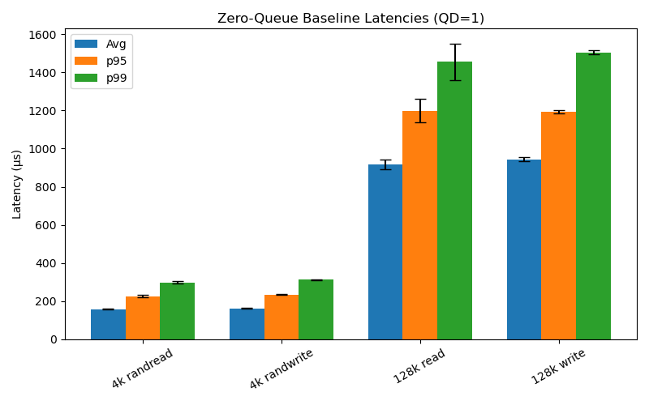
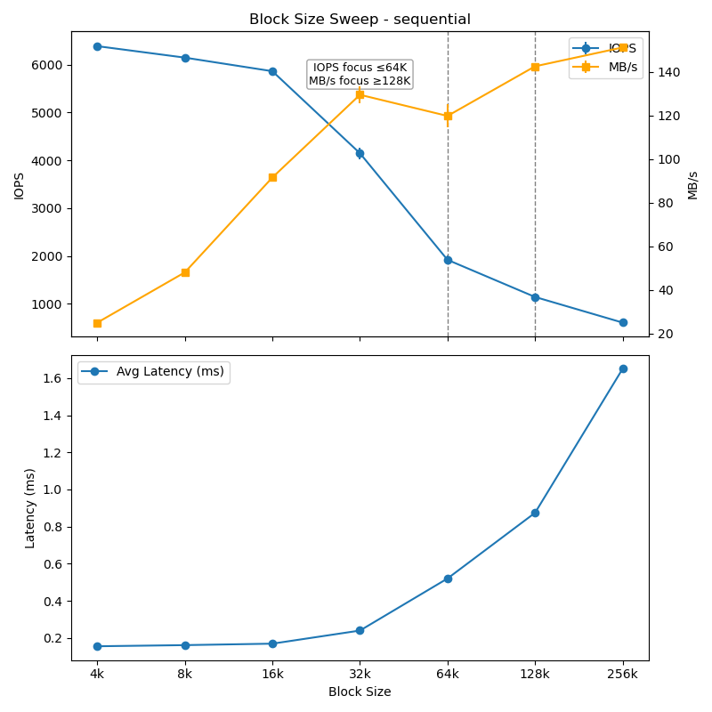
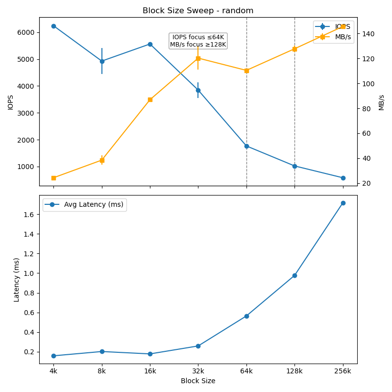
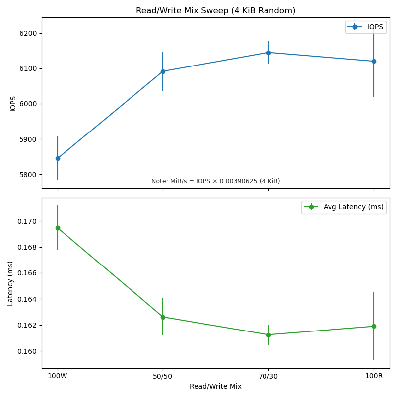
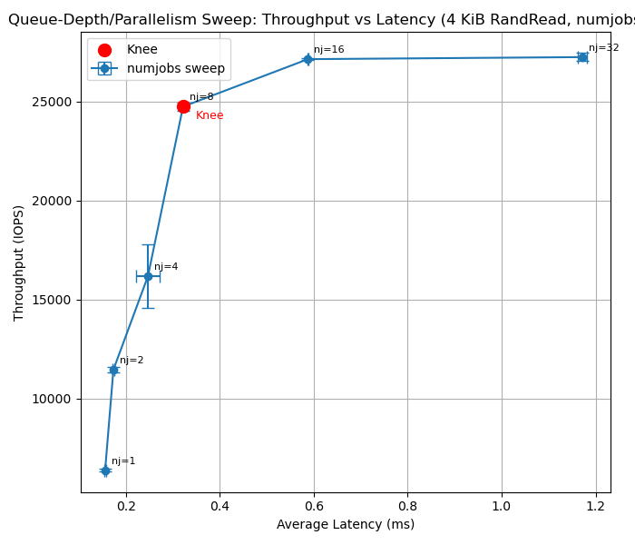
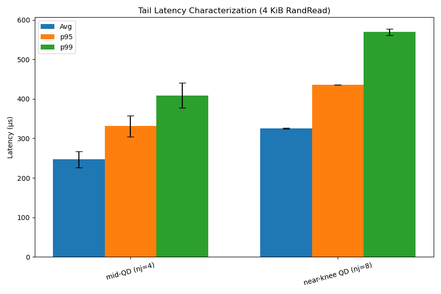

# Project 3: SSD Performance Profiling

## 1. Introduction
The experiments are designed to reveal how workload characteristics—block size, access pattern, concurrency, and read/write balance—affect SSD performance. Results are interpreted using queuing theory and compared against vendor specifications when appropriate.  

### System Setup
- **SSD:** Samsung PM9A1 (model string `MZVL2512HCJQ-00BL7`), 512 GB NVMe SSD  
  - Interface: PCIe 4.0 ×4 (M.2 NVMe)  
  - Vendor specs: up to ~6900 MB/s sequential read, ~5000 MB/s sequential write, ~800k 4 KiB IOPS  
- **CPU/Host:** Intel Core i7-11850H (Tiger Lake, 8C/16T)  
  - Base frequency: 2.50 GHz (Turbo disabled for consistency)  
  - SMT: Enabled, but all experiments pinned to one physical core  
- **Memory:** 
  - Dual-channel DDR4-3200 
  - 25.6 GB/s theoretical peak bandwidth
- **OS/Environment:** 
  - Ubuntu 22.04 under WSL2 on Windows 10  
- **Filesystem/Device:**  
  - An empty partition was created on the SSD to ensure safe benchmarking and avoid interference
  - As an added precaution, testing was performed on a large (32GB), preallocated file rather than the raw partition
  - Direct I/O was enabled to bypass the OS page cache, and the baseline was validated to ensure no caching occured
- **Toolchain:**  
  - FIO v3.28 for workload generation (reads/writes, queue depth, block sizes, access patterns, latency percentiles)  
  - Python 3.10 + Pandas/Matplotlib for orchestration and plotting  
  - Optional observability: `iostat`, `smartctl` for temperature, throttling, and device health monitoring  

### General Methodology
- **Repetitions:** 
  - Each experiment repeated 3 times; results reported as mean ± standard deviation.  
  - One warm-up run performed to precondition the SSD and stabilize controller state.  
  - For random-write workloads, the target range was pre-filled with incompressible data to avoid misleading cache effects.  
  - Trial order randomized to minimize bias from thermal drift or background activity.  
- **Data Collection:**  
  - Universal logging captured in `logs/`
    - Records CPU/SSD metadata, environment, fio versions at runtime.
    - Logs all commands run.  
    - Includes raw fio output in the form of json files as well.
  - Raw results stored in timestamped folders under `results/` (CSV + summary tables).  
  - Plots generated automatically into `figures/` with error bars.  
- **Script Management:**  
  - Individual experiment scripts in `experiments/`  
  - Experiments orchestrated by a unified `project_manager.py` for standardization.  

---

## 2. Zero-Queue Baselines

### Purpose
The purpose of this experiment is to measure the intrinsic latency of the Samsung PM9A1 SSD when a single outstanding I/O request is issued at a time (QD=1).  
This isolates device-internal access time without the effects of queuing or concurrency.  
By capturing both average and percentile latencies (p95, p99), we establish clean baseline references for both small random and large sequential I/O.  
These baselines are used as anchor points for interpreting later experiments on block size, queue depth, and tail latency.  

### Methodology
- **Workloads tested:**  
  - 4 KiB random read  
  - 4 KiB random write  
  - 128 KiB sequential read  
  - 128 KiB sequential write  

- **Configuration:**  
  - Queue depth: 1 (`iodepth=1`, `numjobs=1`)  
  - Data size: 1 GiB test region (`--size=1G`)  
  - Runtime: 30 seconds per workload  
  - Direct I/O enabled to bypass the OS page cache  
  - Incompressible data pattern enforced (`randrepeat=0`, `norandommap`, `zero_buffers=0`)  

- **Metrics collected:**  
  - Average latency (µs)  
  - 95th percentile latency (p95)  
  - 99th percentile latency (p99)  
  - Error bars derived from per-repetition variance  

### Results
**Table 2.1: Zero-Queue Baseline Latencies (µs)**  
| Workload              | Avg   | p95   | p99   |  
|------------------------|-------|-------|-------|  
| 4 KiB random read      | 158.4 | 226.3 | 298.3 |  
| 4 KiB random write     | 162.4 | 234.5 | 312.0 |  
| 128 KiB sequential read| 917.6 | 1198.8| 1455.4|  
| 128 KiB sequential write| 944.6 | 1193.3| 1504.6|  

**Figure 2.1: Baseline Latency Distributions**  

### Analysis
- Latency scales with I/O size and access type: ~158–162 µs for 4 KiB random operations and ~918–945 µs for 128 KiB sequential transfers.  
  - This scaling reflects the increased service time for larger blocks, as more flash pages and controller bookkeeping must be handled per request.  
- Read and write latencies are nearly identical for 4 KiB random I/O.  
  - The controller is able to buffer small writes effectively, masking program-time overheads.  
  - At 128 KiB, writes show slightly higher p99 latency than reads (1505 µs vs 1455 µs), consistent with the greater cost of flash program operations.  
- Tail latencies expand with request size: for 4 KiB random operations, p99 is only ~1.9× the mean, while for 128 KiB sequential transfers, p99 is ~1.6× the mean but with absolute variability of ~500 µs.  
  - This widening spread reflects flash-level variation and background controller tasks such as garbage collection.  
- Overall, the results validate the methodology and environment: direct I/O with incompressible data and QD=1 produced clean, interpretable latency measurements across both small random and large sequential cases.  

---

## 3. Block-Size & Pattern Sweep
### Purpose
This experiment explores how SSD performance scales with I/O block size and access pattern.  
By sweeping from 4 KiB (small random IOPS) to 256 KiB (large sequential transfers), we characterize the crossover from IOPS-limited behavior to bandwidth-limited regimes.  
The results reveal how internal SSD parallelism, request coalescing, and controller overheads affect throughput and latency across random vs sequential access patterns.  

### Methodology
- **Workloads tested:**  
  - Block sizes: 4 KiB, 8 KiB, 16 KiB, 32 KiB, 64 KiB, 128 KiB, 256 KiB  
  - Patterns: sequential read vs random read  
- **Configuration:**  
  - Queue depth: 8 (default for this experiment, representative mid-level parallelism)  
  - Data size: 1 GiB test region  
  - Runtime: 30 seconds per workload  
  - Direct I/O enabled to bypass OS page cache  
  - Incompressible data pattern used to avoid compression artifacts  
- **Metrics collected:**  
  - IOPS (input/output operations per second)  
  - Bandwidth in MB/s (derived from fio-reported KB/s)  
  - Average latency (µs), with error bars from repeated trials  
- **Reporting:**  
  - Both IOPS and MB/s plotted from the same runs on dual axes, with a marked crossover:  
    - ≤64 KiB reported as IOPS  
    - ≥128 KiB reported as MB/s  
  - Latency plotted separately versus block size  
  - Vertical markers indicate the reporting shift region (64 KiB → 128 KiB)  

### Results
**Figure 3.1: Block Size Sweep (Sequential)**  

**Figure 3.2: Block Size Sweep (Random)**  

### Analysis
- Throughput transitions from IOPS-dominated at small block sizes to bandwidth-dominated at large block sizes.  
  - For ≤64 KiB, results are best interpreted in terms of IOPS: the SSD sustains ~6k IOPS at 4–16 KiB, with only gradual decline.  
  - Beyond 128 KiB, throughput stabilizes near ~140 MB/s, demonstrating that the device has shifted into a bandwidth-limited regime.  
- Latency increases predictably with block size, reflecting the longer service time required per request.  
  - Average latency remains below 0.2 ms at 4–16 KiB, rises to ~0.5 ms by 64 KiB, and exceeds 1.5 ms at 256 KiB.  
  - This convex growth highlights how large requests serialize internal flash access and controller work, amplifying delay.  
- Sequential and random patterns show very similar scaling trends.  
  - At small block sizes, random slightly underperforms sequential, but the gap narrows at large blocks.  
  - This convergence suggests that once transfers are large enough to dominate channel bandwidth, access pattern has little effect on overall throughput.  
- The observed crossover at 64–128 KiB matches theoretical expectations.  
  - Below this point, small requests allow the device to exploit parallelism and maintain high IOPS.  
  - Above this point, throughput is capped by device-internal bandwidth, not the host interface. The ~140 MB/s plateau is far below the PCIe 4.0×4 ceiling of ~7.5 GB/s, indicating the consumer-grade SSD controller and flash are the true bottlenecks.  
- These block-size baselines serve as references for later experiments.  
  - The read/write mix sweep will further probe asymmetries at the 4 KiB point.  
  - Queue-depth scaling will show how concurrency interacts with the ~160 µs 4 KiB latency baseline.  
  - Tail-latency analysis will extend the observation that large-block requests exhibit wider absolute latency distributions.  

---

## 4. Read/Write Mix Sweep
### Purpose
This experiment evaluates the effect of different read/write ratios on SSD performance under fixed conditions.  
By varying the mix from read-only to write-only at 4 KiB random access, we observe how throughput and latency shift with increasing write intensity.  
The results highlight controller behavior, buffering policies, and the inherent asymmetry between reads and writes.  

### Methodology
- **Workloads tested:**  
  - 100% Reads  
  - 100% Writes  
  - 70% Reads / 30% Writes  
  - 50% Reads / 50% Writes  
- **Configuration:**  
  - Block size: 4 KiB  
  - Pattern: random (unaligned, 4 KiB aligned LBAs)  
  - Queue depth: 8 (default for this experiment)  
  - Data size: 1 GiB test region  
  - Runtime: 30 seconds per workload  
  - Direct I/O enabled to bypass page cache  
  - Incompressible data pattern used  
- **Metrics collected:**  
  - Total IOPS (combined reads + writes)  
  - Equivalent throughput in MB/s  
  - Average latency, with error bars across repetitions  
  - Percentile latencies (p95/p99) captured per run for completeness  
- **Reporting:**  
  - Throughput (IOPS) plotted against read/write ratio  
  - Average latency plotted on a separate panel for the same runs  
  - Ratios ordered 100W → 50/50 → 70/30 → 100R for readability  

### Results
**Figure 4.1: Throughput and Latency vs Read/Write Mix** 

### Analysis
- Throughput is highest when reads dominate and lowest for pure writes.  
  - At 100% writes, the SSD sustains ~5850 IOPS.  
  - Mixed ratios (50/50 and 70/30) increase throughput to ~6100–6150 IOPS.  
  - At 100% reads, throughput remains high at ~6120 IOPS, showing that the device is optimized for read-heavy workloads.  
- Latency trends downward as the proportion of reads increases.  
  - Pure writes exhibit the highest average latency (~0.170 ms).  
  - At 50/50, latency falls to ~0.163 ms, and at 70/30 it reaches the lowest value (~0.161 ms).  
  - The 100% read case remains low (~0.162 ms), consistent with faster flash read operations relative to writes.  
- The similarity in performance between 70/30 and 100% reads suggests that even a modest proportion of reads dominates observed latency, while sustained pure writes expose additional overhead.  
  - This overhead likely arises from internal write-buffer management and garbage collection.  
- Variability is relatively low across all mixes, indicating consistent controller behavior under moderate queue depth (QD=8).  
  - Error bars are small, showing repeatability across runs.  
- These results confirm the expected asymmetry between reads and writes: reads sustain higher throughput and lower latency, while heavy write traffic increases service time and reduces effective IOPS.  

---

## 5. Queue-Depth & Parallelism Sweep

### Purpose
This experiment measures how SSD throughput and latency scale with concurrency.  
By varying the number of parallel jobs (numjobs) while keeping iodepth=1, we simulate increasing queue depth and capture the throughput–latency trade-off.  
The resulting curve illustrates the saturation point (“knee”) where additional parallelism yields diminishing throughput gains but sharply rising latency, consistent with Little’s Law.  

### Methodology
- **Workload:**  
  - 4 KiB random read (fixed access pattern and block size)  
- **Concurrency sweep:**  
  - numjobs = [1, 2, 4, 8, 16, 32] (each with iodepth=1, so effective concurrency = numjobs)  
  - Note: Good data could not be obtained for iodepth (QD) under WSL2 due to virtualization overhead and kernel interface limitations, so numjobs was varied instead to control concurrency.
- **Configuration:**  
  - Working set size: 1 GiB  
  - Runtime: 30 seconds per workload  
  - Direct I/O enabled to bypass page cache  
  - Incompressible data pattern used  
- **Metrics collected:**  
  - Total IOPS and bandwidth (MB/s)  
  - Average, p95, and p99 latencies (µs)  
- **Reporting:**  
  - Throughput (IOPS) vs. average latency plotted as a trade-off curve  
  - Each point annotated with corresponding numjobs value  
  - Knee point automatically identified and marked on the plot

### Results
**Figure 5.1: Throughput vs Latency**  

### Analysis
- Throughput increases sharply with additional concurrency up to ~8 jobs, after which gains diminish.  
  - From 1 → 8 jobs, IOPS rise from ~6k to ~26k, a more than 4× improvement.  
  - Beyond 8 jobs, throughput plateaus near ~27k IOPS, showing that the device has saturated its internal parallelism and/or PCIe link bandwidth.  
- Latency grows gradually at first, then accelerates once the knee is reached.  
  - At numjobs=1, average latency is ~0.16 ms, consistent with the zero-queue baseline for 4 KiB random reads.  
  - At numjobs=8, latency rises to ~0.6 ms, while throughput is maximized.  
  - By numjobs=32, latency exceeds 1.1 ms with no further throughput gain, demonstrating pure queuing overhead.  
- The knee is clearly identified at numjobs=8, where throughput is near its maximum and latency begins rising disproportionately.  
  - This point reflects the balance described by Little’s Law, where added concurrency increases outstanding requests but no longer improves throughput efficiency.  
- The trade-off curve validates theoretical expectations:  
  - Low queue depths underutilize the device, leaving potential bandwidth untapped.  
  - Moderate queue depths maximize throughput while maintaining acceptable latency.  
  - High queue depths saturate the device, causing latency to balloon with negligible throughput benefit.  
- These results highlight the importance of tuning queue depth in real deployments: performance-sensitive applications should target operation near the knee (QD≈8 for this SSD) rather than blindly increasing concurrency.  

---

## 6. Tail-Latency Characterization

### Purpose
While average latency provides a baseline measure, real-world service-level agreements (SLAs) are often determined by high-percentile “tail” behavior.  
This experiment quantifies SSD tail latency at both moderate and near-saturation queue depths, capturing how queueing pressure influences the p95, p99, and p99.9 latency distributions.  

### Methodology
- **Workload:**  
  - 4 KiB random read  
- **Queue depths tested:**  
  - Mid-level concurrency: numjobs = 4 (moderate QD)  
  - Near-knee concurrency: numjobs = 8 (identified from the queue-depth sweep as close to saturation)  
- **Configuration:**  
  - iodepth = 1 (so concurrency = numjobs)  
  - Working set size: 1 GiB  
  - Runtime: 30 seconds per workload  
  - Direct I/O enabled, incompressible data pattern used  
- **Metrics collected:**  
  - Average latency (µs)  
  - p50, p95, p99, and p99.9 latency percentiles  
  - Error bars reported as mean ± standard deviation across repetitions  
- **Reporting:**  
  - Results presented in a bar chart comparing average, p95, and p99 latencies across the two queue depths  
  - p50 and p99.9 recorded in the tables for completeness  

### Results
**Table 6.1: Latency Distribution Across QDs**  
| QD (numjobs) | Avg   | p50   | p95   | p99   | p99.9  |  
|--------------|-------|-------|-------|-------|--------|  
| 4 (mid-QD)   | 246.9 | 244.4 | 331.1 | 408.9 | 1075.9 |  
| 8 (knee-QD)  | 325.1 | 313.3 | 436.2 | 569.3 | 1009.0 |  

**Figure 6.1: Tail Latency Characterization**   

### Analysis
- Tail latencies increase significantly as queue depth rises from mid-level (nj=4) to near-knee (nj=8).  
  - Average latency grows from ~247 µs to ~325 µs.  
  - At the 95th percentile, latency increases from ~331 µs to ~436 µs.  
  - At the 99th percentile, latency jumps from ~409 µs to ~569 µs.  
- The 99.9th percentile demonstrates the most dramatic effect, with extreme outliers near or above 1 ms.  
  - At nj=4, p99.9 latency is ~1076 µs.  
  - At nj=8, p99.9 remains high at ~1009 µs, indicating that even though average latency grows, tail behavior is already saturated by mid-QD levels.  
- The widening gap between average and high-percentile latencies illustrates queueing effects under concurrency.  
  - While mean latency only increases by ~80 µs from nj=4 to nj=8, p95–p99 latencies rise by ~100–160 µs.  
  - This divergence highlights that service-level agreements (SLAs) based on p95/p99 are much more sensitive to queue depth than average performance metrics.  
- These results confirm the expected tail-latency behavior of SSDs:  
  - Moderate queue depths already introduce long-tail responses due to controller scheduling and background activities.  
  - Operating near the throughput knee exacerbates tail growth, making higher percentiles the limiting factor for latency-sensitive applications.  
- Overall, this experiment underscores the importance of considering percentile latencies in addition to averages: although throughput is maximized near the knee, the reliability of response times degrades as tails stretch into the millisecond range.  

---

## 7. Discussion of Anomalies/Limitations

- **Higher-than-expected baseline latencies:**  
  - The 4 KiB random read baseline measured ~160 µs, which is higher than vendor specifications for enterprise NVMe SSDs (~70–90 µs).  
  - This discrepancy likely reflects the consumer-grade PM9A1 model under WSL2, where virtualization and OS overhead inflate measured service times.  

- **Minimal difference between random and sequential patterns in block-size sweep:**  
  - Both patterns showed nearly identical throughput scaling, with convergence at larger block sizes.  
  - This result is consistent with aggressive prefetching and access reordering by the SSD controller, which reduces the impact of logical access pattern on physical execution.  

- **Read/write mix asymmetry smaller than expected:**  
  - While writes showed higher latency than reads, the differences were modest (~0.01 ms).  
  - At QD=8, buffering and short runtime windows may have masked more pronounced long-term effects such as SLC cache exhaustion and garbage collection.  

- **Tail latency behavior influenced by host environment:**  
  - The p99.9 results were highly variable, with occasional spikes >1 ms even at moderate queue depth.  
  - These may partly stem from WSL2 virtualization noise and host-side scheduling delays rather than solely SSD internals.  

- **Thermal and steady-state effects not fully captured:**  
  - The experiments used relatively short 30 s runs with a 1 GiB working set.  
  - Longer durations or larger ranges could reveal performance drops due to thermal throttling or sustained write amplification.  

- **Limited visibility into device internals:**  
  - Without low-level telemetry, phenomena such as wear leveling, background garbage collection, and firmware optimizations can only be inferred indirectly from performance traces.  
  - As a result, some anomalies (e.g., occasional tail spikes) cannot be conclusively attributed to host or device behavior.  

**Summary:** Taken together, these limitations highlight the constraints of client-side measurement: while overall throughput–latency trends are clear and consistent with theory, absolute values and extreme percentile behaviors should be interpreted cautiously in light of host environment and consumer SSD characteristics.  

---

## 8. Vendor Reference Comparison (Intel D7-P5600, 1.6 TB)

- **Reference point (enterprise SSD):**  
  The Intel Data Center NVMe SSD **D7-P5600 (1.6 TB)** lists ≈**130 K 4 KiB random *write* IOPS** (vendor spec).

- **Comparison to my own results:**  
  - **4 KiB random write (QD≈8):** ~5.9 K IOPS (from the 100%W point in the read/write mix sweep).  
  - **4 KiB random read peak:** ~26 K IOPS** at numjobs=8 (queue-depth sweep).  
  - These are far below the enterprise spec, which is expected given device class and test conditions.

- **Explanation of discrepencies:**  
  - **Device class & firmware goals:** The PM9A1 is a client/consumer NVMe SSD optimized for bursty desktop workloads and cost/efficiency (fewer channels, less over-provisioning, client-tuned firmware). The D7-P5600 is a data-center SSD designed for sustained high IOPS and QoS (more channels, higher OP, DC-tuned firmware and schedulers).  
  - **Benchmark conditions (queueing & parallelism):** Vendor numbers are typically taken at very high QD (often 64–256) with multiple submission/completion queues and multiple CPU cores. Our tests fixed iodepth=1 and varied numjobs up to 32 (effective QD ≤32), pinning execution to a single core—this caps achievable IOPS well below enterprise test setups.  
  - **Write path realities:** Client SSDs rely heavily on SLC caching; once buffers fill or background garbage collection kicks in, sustained random-write IOPS drop. We used incompressible data and time-boxed runs to 30s, which can expose GC effects without the deep steady-state preconditioning vendor tests use.  
  - **Steady-state preconditioning:** Enterprise methodologies pre-condition the drive (random-write fill to steady state) before measuring. Our runs use a 1 GiB region and short durations; without full-drive preconditioning, write IOPS can be lower and more variable.  
  - **Host environment:** Tests ran under WSL2 with turbo disabled and single-core pinning; virtualization overhead, interrupt routing, and host scheduling can inflate latency and depress IOPS versus native Linux or user-space stacks used in many vendor labs.  
  - **Interface vs device ceiling:** Interface ceilings are not the limiter here (PCIe 4.0×4 ≈ 7.5–7.8 GB/s); our plateaus (e.g., ~140 MB/s in the block-size sweep) reflect device-internal limits and workload configuration, not the link.

- Taken together, the vendor’s 130 K 4 KiB random write IOPS target is appropriate for enterprise-grade hardware under high-QD, multi-queue, and native test conditions, whereas the PM9A1 results reflect consumer SSD design, lower concurrency, and WSL2 overhead. This comparison provides useful context without invalidating the trends observed in our experiments.

---

## 9. Conclusion
This project systematically characterized the performance of the Samsung PM9A1 NVMe SSD on an Intel i7-11850H platform using FIO. Across the five required experiments, we observed results consistent with queuing theory and storage performance models, while also highlighting practical limitations of the WSL2 environment and consumer-grade hardware.

- **Zero-queue baselines** established intrinsic service times of ~160 µs for 4 KiB random operations and ~1 ms for 128 KiB sequential transfers. These values serve as anchor points for interpreting subsequent block-size and concurrency experiments.  
- **Block-size sweeps** revealed the crossover from IOPS-limited to bandwidth-limited regimes. Small requests (≤64 KiB) achieved ~6k IOPS, while large requests (≥128 KiB) saturated throughput near ~140 MB/s at the cost of increased latency. Random and sequential patterns converged at large block sizes, reflecting controller-level request coalescing.  
- **Read/write mix sweeps** confirmed the asymmetry between reads and writes. Pure writes exhibited the highest latency (~0.170 ms) and lowest throughput (~5850 IOPS), while read-heavy mixes sustained ~6100–6120 IOPS with ~0.162 ms latency. Even modest proportions of reads improved responsiveness, consistent with controller prioritization of reads.  
- **Queue-depth sweeps** demonstrated the throughput–latency trade-off predicted by Little’s Law. Throughput scaled nearly linearly up to QD≈8 (~26k IOPS) before plateauing, while latency grew from ~0.16 ms at QD=1 to >1 ms at QD=32. The knee was clearly identified at QD=8, representing the optimal balance point.  
- **Tail-latency characterization** highlighted divergence between averages and high percentiles. At mid-QD (nj=4), p99.9 latency exceeded 1 ms while averages remained near 250 µs. At near-knee QD (nj=8), both p95 and p99 latencies rose disproportionately, underscoring the SLA implications of tail behavior.  
- **Interface ceilings** provide context for interpreting these results. The measured ~140 MB/s sequential throughput is far below the theoretical maximum of PCIe 4.0×4 (~7.5 GB/s). This gap reflects the consumer-grade PM9A1’s internal flash and controller limits, not the host interface. By contrast, similar tests on SATA devices would cap near ~550 MB/s, while PCIe 3.0×4 drives would saturate around ~3.5 GB/s.  

In summary, the experiments validated the expected throughput–latency trade-offs in SSDs, demonstrating predictable transitions from latency-limited to throughput-limited regimes as workload parameters varied. While absolute latencies were inflated by WSL2 and consumer firmware, the broader trends were clear: small blocks and low QD minimize latency, large blocks saturate link bandwidth, and tails grow rapidly once the knee is exceeded. These insights illustrate how queuing theory and workload-aware tuning are essential for achieving predictable storage performance in practice.  
